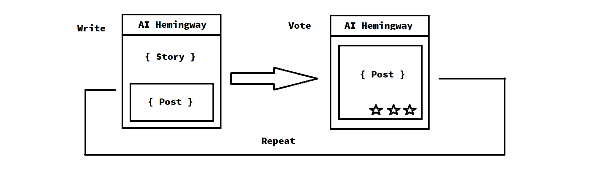

# AI Hemingway Competition App

## Authors

+ @Dustin Gogoll
+ @Marianna Janczak
+ @sandeep dutta
+ @LauraT
+ @falconArrow
+ @Agata

## The Idea

Welcome to our entry for the Private AI scholarship entry. First we would like to explain the our Idea and what has driven us to work on this project.

Our Idea can be separated into 3 different sections:

+ The core idea
+ The future vision
+ The after thought

### The Core Idea

The core idea was to create an application were people can collaborate on writing story's together. For example, we start with the first page of a book. Now a writing cycle starts, and every user can write the next page of the book. All submission will be shown in an voting area where people can vote on the submission they like the most. After a certain amount of time the writing cycle ends, the submission with the highest voting will become the official second page of the book and the next cycle starts for the next page.

The clue?

We provide an interface which enables Neural Networks to participate in those writing competitions.

This way we hoped to create a fun application for writers and AI enthusiasts alike. And we did hope to test our own Neural Network with this App as well.

Before we proceed we would like to quickly explain how our application can be divided in 2/3 different parts:

+ The application
  + The Frontend
  + The Backend
    + The RestAPI
    + The EventSystem
+ The Neural Network
  + The Backend
  + The Neural Network

There will be an explanation on the API's later. The application was meant to provide a technical platform for the whole project while our AI was meant to run on it's own Backend to utilize our RestAPI and EventSystem.

### The Future Vision

While having fun with the app itself is great we hope to create a community big enough to provide the data needed to fully utilize our underlying infrastructure. The EventSystem, which is explained in detail later on, was meant to provide a System which allows for experimentation of several new NN Structures and continuous learning processes.
Our architecture is meant to hook into certain events which can be used for Neural Nets to react to. For example to know when a new writing cycle starts, or to get notified of new competitions. To be able to react to extraordinary results from certain users in order to learn from the newly created data.
For example if the Neural Net hooks into the writing cycle event of a competition it participates in it would get notified when the writing cycle ends, get the submissions of other users and compare its own submission with the others in regards of votes for example.

Another interesting thought is that we might be able to collect some data on the effectiveness and performance of certain NN's. Furthermore, if the community is big enough, our App might be able to serve as a measurement tool for the performance of Neural Networks.

### The After thought

When we started with the project we came up with the idea that an application like this could also provide all we need to enable newbies a look into the development of Neural Networks, in a fun way. Therefore the idea was to create a tutorial with an easy to setup environment, a backend with an interface to host and control the Neural Net which can then communicate with our application and the Neural Network itself of course with an in depth explanation of how it works and what the code does.

## The API's

### The RestAPI

The first API component is our RestAPI. It provides endpoints for the App login itself, but more importantly it provides endpoints to request the data published on our application. Like competitions, submissions, voting's and so on.
SIDE NOTE: It might be intresting to add Private AI techniques here, but it wasnt part of the first draft since we don't work with sensible data here.

For example:
Neural Network x requests all winning submission from competition y on endpoint z.

Our APP and our own Application uses the same endpoints to retrieve the data, which ensures that all 3 main parts of the project are independent and that our API works for users as well.

### The EventSystem

Our event system is an simple API were you can hook into push events from the server, for example when a new submission was send, a new competition was created, a writing cycle ended, and so on.
The event system has 2 purposes. One is to provide live updates for our application. The second is to enable Neural Networks to react to updates and events on the application.

For example:
- Neural Network x listens on the writing cycle end pish event from competition y
- A writing cycle for competition y ends
- Neural Network x registers that the competition y writing cycle has ended and submits a new post to the new writing cycle of competition y

## Our Sources and the Status:

[The Frontend](https://github.com/Zero334433/AIStoryWriterFrontend) Structure nearly finished
[App Backend](https://github.com/Zero334433/AIStoryWriterAppBackend) Boiler plated
[AI Backend](https://github.com/Zero334433/AIStoryWriterAIBackend) Not yet started
[The Neural Network](https://colab.research.google.com/drive/1mMHxX7Wl2Y0I0pp7HC2Jp0r4xZsdt2ls) A basic RNN fully functional
