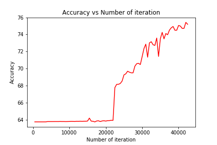
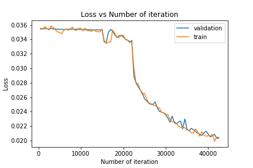

# Secure amazon_fine_food_review score classification
The aim of this repository is to present the project 'amazon_fine_food_review score classification' for the 'Private and Secure AI' challenge from Udacity. This is an individual project by Aisha Khatun (@aisha khatun,https://github.com/tanny411).

# Project Overview
This project focuses on **score detection** of the reviews. The scores given by the users are in the range of 1 to 5. So the project has to handle 5 classes. This score is predicted by the model based on the Text provided by the users. I use the [dataset](https://www.kaggle.com/snap/amazon-fine-food-reviews) acquired from kaggle named amazon-fine-food-reviews. Project was completed using Pytorch. The model can be used to detect the sentiment of a text on a scale of 1 to 5 in general, thus related to 'Social'. Another aspect of the project is the use of secure methods to perform model training. This project thus includes differentially private deep learning, plus federated learning on top of the created architecture. The intention is to be able to use user reviews from multiple sites or organizations without essentially collecting or extracting any data, therefore maintaining organization trust. 

# Basic Work Flow
- Text cleaning and tokenization
- Model Creation (lstm)
- Evaluation
- Graphical results presentation

# Detailed Work Flow
- Data Download from Kaggle
- EDA: Basic Data exploration and null value removal. 
- Tokenization
	- Punctuation spaced (e.g 'ok.fine' => 'ok . fine')
	- Short forms separated (e.g don't => do n't)
	- special tokens added: begining of sentence token(xbos), all upper case word(xwup), word begining with upper case(xup)
	- example tokenization: 'this isn't an Easy PROJECT!' => 'xbos this is n't an xup easy xwup project !'
- Dataset Pre-processing
	- Dataset split into validation set, which is 20% of the original dataset.
	- Vocabulary, Numercalization(text to number) etc is handled with the help of torchtext
- Model Details
	- A basic lstm model was created with an embedding layer. The embedding layer was initialized with 'glove.6B.100d' pretrained embeddings.
	- Then an lstm layer was used.
	- Followed by two fully connected layers
	- Finally prection was given by the output layer with softmax.

### Dataset Details:

|Score|Samples
|---|---|
1|52268
2|29769
3|42640
4|80655
5|363122

# Results
After just 3 epochs on the entire dataset an accuracy of 73% was achieved. Due to time restraint the model was not further trained. But training and further works(mentioned later) are scheduled to be completed soon. 

The accuracy and loss graphs are given below. The graphs are made from loss and accuracy calculation of the validation data after each batch of model training.
## Accuracy

## Loss

## Further Work
This work was implemented mainly keeping privacy in mind. Remaining parts of the project include:
- Introducing differential privacy through simulated distribution of the data among several Vitual Workers
- Introduction of Federated learning to encrypt both the model and the data for even more security
- Model Improvement. This model will be further improved using various model-types experimentation and hyperparameter tuning.
- I intend to use transfer learning for this purpose, the transferred model also being encrypted. This allows anyone to build a model and disseminate it freely without fear of data revelation or model alteration. 
