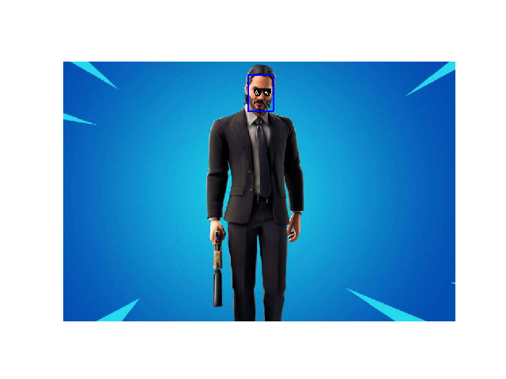
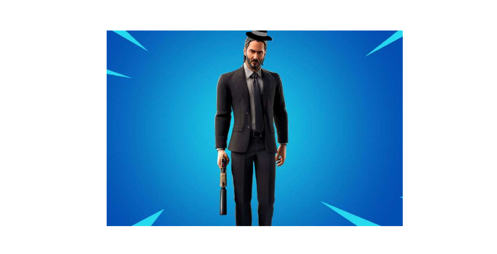

# flaffylter

Use **snapchat** like  filters while maintaning your **privacy**.

**Based on** [charlielito](https://github.com/charlielito/snapchat-filters-opencv) work **snapchat filters with opencv**  
**Using** [1adrianb](https://github.com/1adrianb/face-alignment) framework for **face recognition** and **facial landmarks** detection.
Both steps uses **pytorch**.
- Use facial filters like:
  - glasses
  - hats
  - facial makeup
  - faceswap
  - face aging
 - You face images will be **encrypted**.
 - While in the server image  cannot  **reveal your face**.
 
 
 # Filter Examples 

### Face detected with Glasses

### Doggy ears

###  Elegant hat

### Rainbow 

