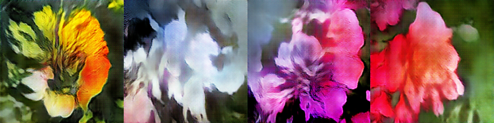

# Art Flower Genertor
This repository contains the showcase project developed in the Secure and Private AI Scholarship. For more details, please visit this [site](https://github.com/LsAntonio/art-flowers)

__Author:__ _L. Antonio._
__email:__ _antonio@kapaitech.com_
 
## Introduction
<p align = "justify"> 
Generative Adversarial Networks (GAN’s) are powerful models, which allow us to learn data distributions. Thus, allowing us to generate new data. This is achieved in a competitive fashion, were a generator tries to fools a discriminator. In each epoch, both models become better at learning. In this dynamic, the generator, creates more realistic data, which is more close to the real data distribution. Meanwhile, the discriminator gets better at distinguishing the real data from the fake ones created by the generator. The training will conclude when an equilibrium point is achieved. Where, neither generator or discriminator can improve. In this repository, a GAN model is used to generate painting flower images. The project was mainly developed in pytorch.
</p>

## Installation
<p align = "justify"> 
This project was developed in Ubuntu 19.04, therefore it is most likely to be compatible with other Ubuntu versions such as: 16.04 +. If you use other OS, you would need to adjust some configurations. First, download or clone this repository. Then create a virtual environment. You can use python native environment manager or conda environments. Once you created the environment, make sure to install the following dependencies:
</p>

* torchvision==0.2.2
* pytorch-cpu=1.1.0 (if you have a GPU, then install the GPU version)
* numpy==1.16.2
* Pillow==5.4.1
* matplotlib=3.0.3
* python=3.7.2

Also, you need to download the trained model. You can download them from [here](https://drive.google.com/file/d/1TJdUnP5ZQrJfuMgbdX6BcBZBjDzfuH7I). Make sure to unzip and put this file inside a the _model_ folder.

## Running
<p align = "justify"> 
This program allow you to generate images with different sizes: 256 x 256 and 406 x 406. Also you can generate a gif containing a walk in the latent space. First, make sure to have your virtual environment activated. Next, open a terminal window in the scripts folder. Now, to generate a 256 x 256 image, insert the command:
</p>

```
python main.py -i 1 -s 256 | This will generate a single image, which will be saved in the 256 folder.
```

_To generate a 406 x 406 image, use the command:_

```
python main.py -i 1 -s 406 | This will generate a single image, which will be saved in the 406 folder.
```

_To generate a gif, use the following command:_

```
python main.py -i 1 -s 256 -g ‘y’
```
<p align = "justify"> 
The command above will generate a single image, which will be saved in the 406 folder, alongside a 256 x 256 gif. The same process can be applied to generate a 406 x 406 gif, just change the size.
</p>

## Results
The following images were generated using the model.



As we can see, these are flower images, but with art variations.


## Demo

<p align="center">
<a href="https://www.youtube.com/watch?v=4JwqccCi7kI" target="_blank">
  
</a>
</p>

## Conclusions
<p align = "justify"> 
Generative models are powerful architectures, which allow us to generate a diverse variety of data. It is interesting to see how these models can approximate the real data distribution using the game-theory framework. Although, in this project, the generator is the one who generates the data, we cannot ignore the importance of the discriminator, which also acted as a teacher. Once said that, we also need to consider the trade-off in the training procedure, since we are dealing with two models, instead of one. Finally, the model was able to learn to generate artistic flowers using just a random noise vector as input.
</p>
