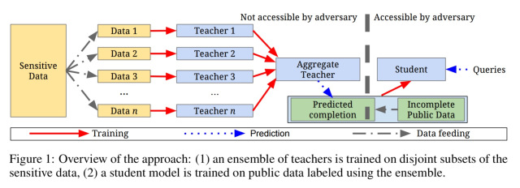
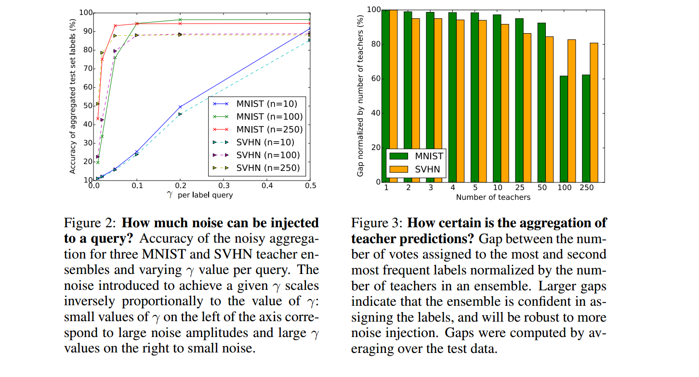

<h1 align=center> PATE_Analysis </h1>

<h5 align=center> Classification_of_MNIST_Digits_using_Differential_Privacy_and_performing_PATE_analysis_on_that_model <h5>

I have Implemented **"SEMI-SUPERVISED KNOWLEDGE TRANSFER FOR DEEP LEARNING FROM PRIVATE TRAINING DATA"** Model according to the official paper [link](https://arxiv.org/pdf/1610.05755.pdf) 

### TRAINING AN ENSEMBLE OF TEACHERS PRODUCING PRIVATE LABELS

I am able to train ensembles of 250 teachers. Their aggregated predictions are accurate despite the injection of large amounts of random noise to ensure privacy. The aggregation mechanism output has an accuracy of 92.363% for MNIST when evaluated on their respective test sets, while each query has a low privacy budget of Epsilon = 0.25 and delta 1e-5

----------

 <b>Contributor: Archit (Slack handle : @Archit)</b>

