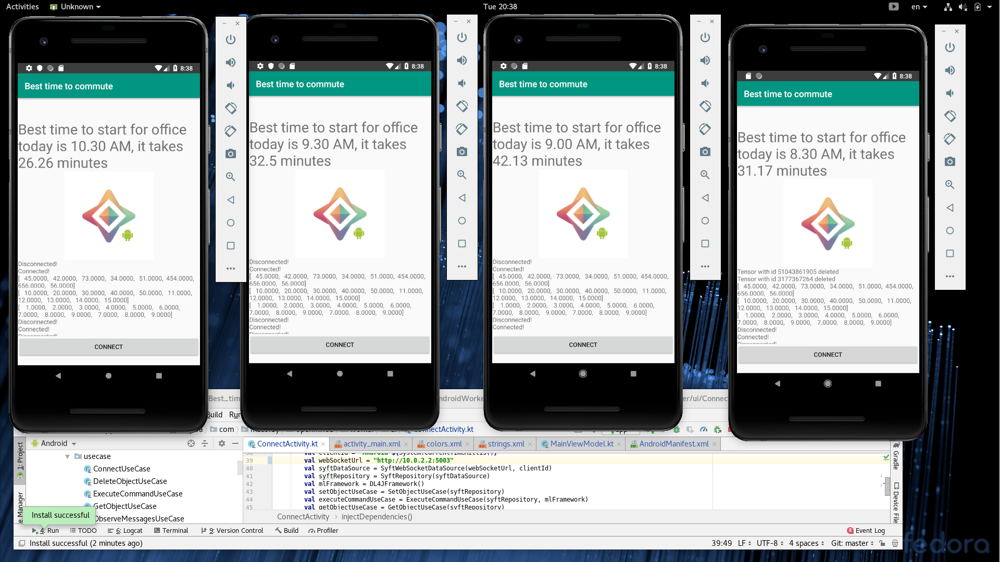
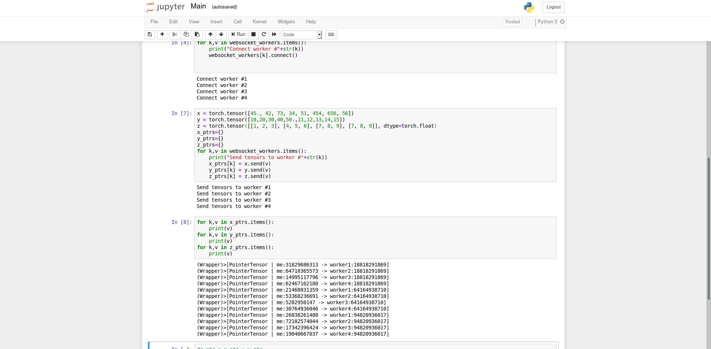

# Android application for predicting best time to start commute

## Idea of the project

Android application which is automaticaly predict best time to start commute based on historical location data and calculated time.

## Real world problem
Saving time and avoiding traffic jams
***

## Why Federated Learning:
The location data for model training is saved only on mobile device and cann't be disclosed. So each individuals save his privacy.

***

### Detailed algorithm and future ideas for implementation

Android application is automatically collecting GPS data and timestamp during day(week,month) in JSON format:
```json
timestampMs:1415051512187
latitudeE7:404212794
longitudeE7:-36286372
accuracy:34
```
Based on collected historical data when device is charging and connenced to WiFi:
- calculate and mark home and work geo location
- calculate time to commute at particular day of the week
- detect type of movement based on sensors data 
+ train the model for predicting using previosly prepared data
+/- share model between other users of the app
- predict to start from home to reach office fastest by user click

***

### Demo


4 Android workers which are connected to 4 WebSocketIOServers [details here](Android_federated_learning/)


and orchestrated in notebook (only tensors moving operations implemented for now)


***

Note: Text with best time is just predefined text for better explanation of our idea


### Code
- Example of very basic Android Federated Learning [here](Android_federated_learning)
- Example code of model and dataset for the making predictions based on 1 month data [here](Kernel_and_dataset) 

***

### Project lead
-  [Nataliia Donovska](https://github.com/ndonowski) - @Natali

### Contributors/Team
-  [Dmytro Martyniuk](https://github.com/dmtk/) - @Dmytro Martyniuk
***

### Links
- 1.[PySyft for Android](https://towardsdatascience.com/pysyft-android-b28da47a767e)
- 2.[Grid library](https://github.com/OpenMined/Grid) 
- 3.Another article taken as a base for the project [link](http://simpleconcepts.org/predict-the-best-time-to-commute-to-office-by-avoiding-traffic-jams-machine-learning-application-by-using-pytorch-regression/) 
- 4.How to download history of locations of an android mobile device and example dataset [link](https://www.kaggle.com/juliansimon/location-history)
