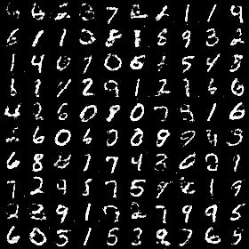
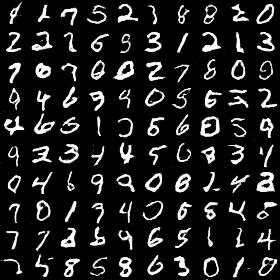
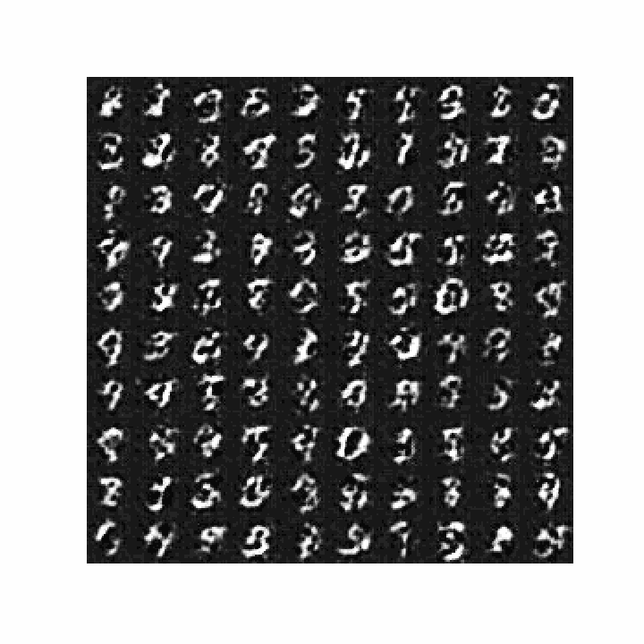
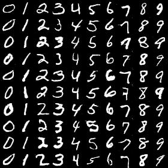
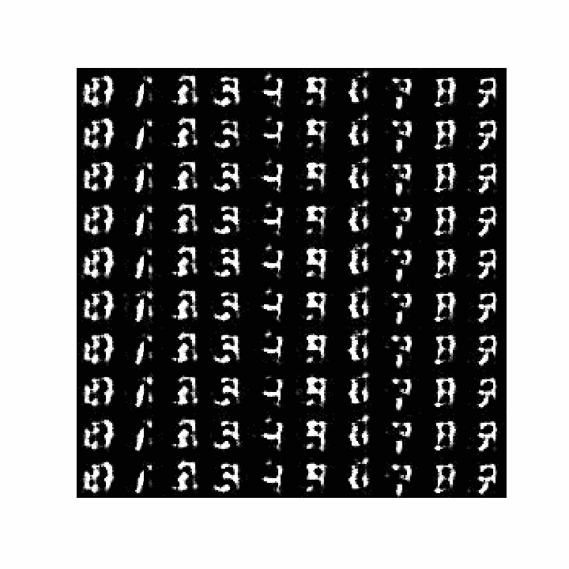
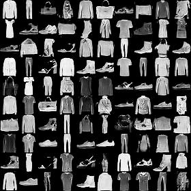
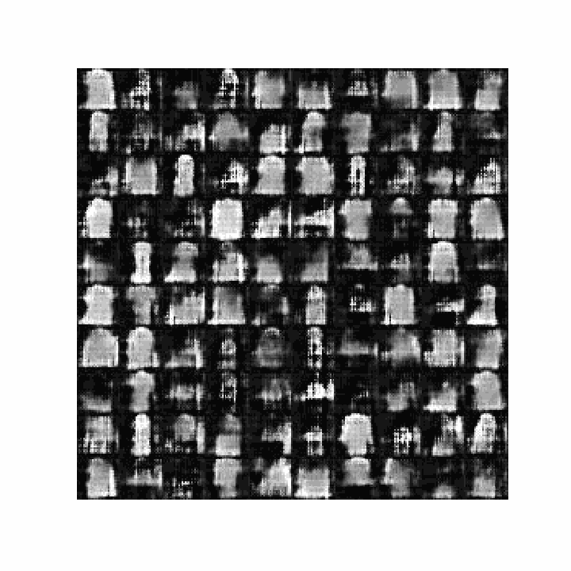
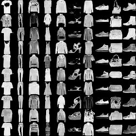
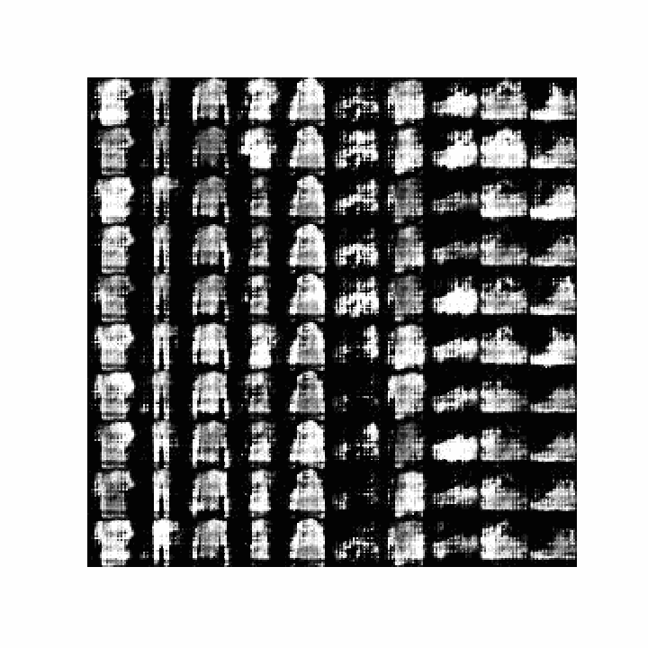

# GAN Implementations

1. [Basic GAN](Basic_GAN.ipynb) :- Implementation of [Generative Adversarial Nets](https://papers.nips.cc/paper/5423-generative-adversarial-nets.pdf) paper. Generator and Discriminator doesn't use maxout layer used in the paper.
2. [DCGAN](DCGAN.ipynb) :- Implementation of [Unsupervised Representation Learning with Deep Convolutional Generative Adversarial Networks](https://arxiv.org/pdf/1511.06434.pdf)
3. [Conditional DCGAN](Conditional_DCGAN_MNIST.ipynb) :- Implement [conditional GAN](https://arxiv.org/abs/1411.1784) using DCGAN architecture.

## GAN Results

### MNIST

|GAN | Generated images |Generated images GIF| 
|---| --- |----|
|[Basic GAN](Basic_GAN.ipynb)|||
|[DCGAN](DCGAN.ipynb)|||
|[Conditional DCGAN](Conditional_DCGAN_MNIST.ipynb)| | |

### Fashion MNIST

|GAN | Generated images |Generated images GIF| 
|---| --- |----|
|[DCGAN](DCGAN.ipynb)|||
|[Conditional DCGAN](Conditional_DCGAN_MNIST.ipynb)| | |
