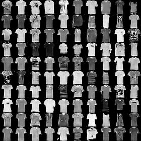
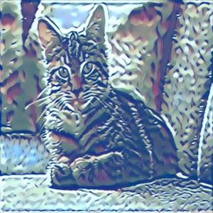
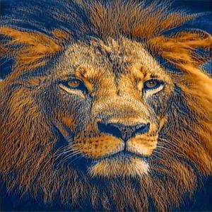
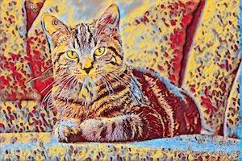
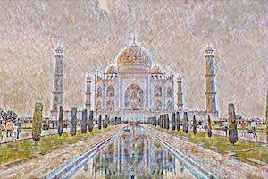

# Projects done as Part of Secure and Private AI challenge 

## Tshirt Design

Using GAN and Neural Style Transfer to Create T-Shirt Designs

#### Current Results

|Model | Generated images |
|---| --- |
|[Conditional DCGAN](GAN_design/GAN_implementations/Conditional_DCGAN_MNIST.ipynb)| |
|CycleGAN | Work in Progress |
|[Neural Style Transfer](GAN_design/Neural_Style_Transfer/Neural_Style_Transfer.ipynb)|  |
|[Neural Style Transfer](GAN_design/Neural_Style_Transfer/Neural_Style_Transfer.ipynb)|  |
|[Fast Neural Style Transfer](https://github.com/pytorch/examples/tree/master/fast_neural_style)|  |
|[Fast Neural Style Transfer](https://github.com/pytorch/examples/tree/master/fast_neural_style)|  |

#### Notes
* Conditional DCGAN result is grid of 100 generated T-shirt images.
* CycleGAN implementation is completed, but need to train for few days for better results.
* For future work, Need to implement other variations of GANs and tuning for usecase of generating Designs.

## Secure and Private AI 

### Training Deep Learning Models with Differential Privacy
   
   Using MNIST data to train student model using n teachers models and performing PATE analysis
   
### Smart Keyboard via Federated Learning [Work in Progress]
   
   Training next word prediction model using federated learning with pysyft
