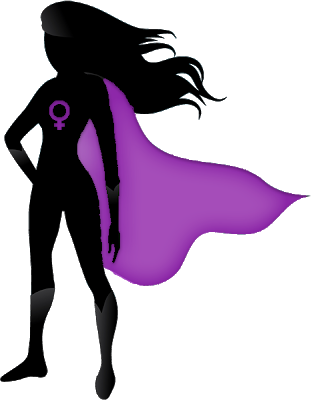

Group project from the **Purple Power Rangers** (#sg_prpl_power_rangers):
- Elena Greblova (@Elena),
- Eileen Hertwig (@Eileen),
- Elena Kutanov (@Elena Kutanov)

## Challenges in Representation Learning: Facial Expression Recognition

In this project our team used data from https://www.kaggle.com/c/challenges-in-representation-learning-facial-expression-recognitionchallenge/data to explore facial expression recognition with PyTorch and Deep Learning.

We trained three types of models: Linear model, CNN model written from scratch and ResNet models from torchvision.models package.
The predictions accuracy of the trained models was then compared to find out which one has best performance with FER2013 dataset.

  

