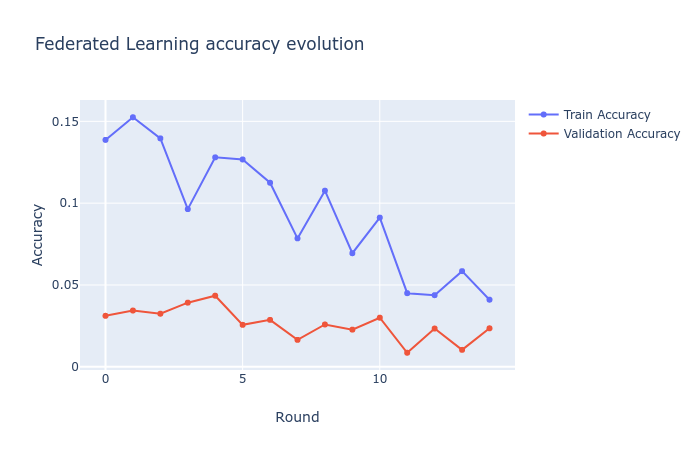
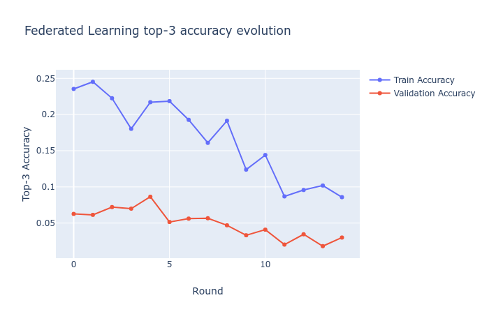

# Top3Next: A Gboard knock-off #

This repository is dedicated to the Project Showcase Challenge from Udacity 
Private AI Scholarship Program. Here, a small project is presented with
a simpler implementation of the functionalities of Gboard using Federated 
Learning for next word prediction. The original results were described in the paper 
[FEDERATED LEARNING FOR MOBILE KEYBOARD PREDICTION](https://arxiv.org/pdf/1811.03604.pdf)
by Google AI team. 

## Objectives

The present project intends to reproduce actual user data
that can be sent to a Machine Learning model. In order to have a smoother 
training and a better federated model the following steps in processing the dataset
were taken:

- [X] Restricting the data only to frequent users of the platform;
- [X] Clear the raw entry data from users (eliminating empty samples, 
duplicates and emoticons, ravelling contracted forms and removing stop words);
- [X] Preserve the timestamp of the usage and keep data ordered by the respective timestamp;
- [X] Split the data into server-side's and client-side's;
- [X] Transform text to sequences using a context of given size.

The processed data was then used in both the traditional supervised learning in
server-side and using federated learning in client-side reproduced using 
[Pysyft](https://github.com/OpenMined/PySyft). In order to find the best model
limited by a 20ms time response for each sample, the following actions were 
done:

- [X] Try a few different models for next word prediction in the server-side 
data;
- [X] Train the server-side model and send it to the batches of users;
- [X] Execute rounds of training into batches of users data;
- [X] Create a simple visualization pipeline for the federated training process;
- [ ] Observe the improvement of accuracy over rounds for the federated trained model.

## Datasets

I would like to acknowledge Alec Go, Richa Bhayani, and Lei Huang for 
making available the [sentiment140 dataset](http://help.sentiment140.com/for-students)
with 1,600,000 tweets. The choice of using Twitter data can be justified by the
fact that it is the closest one could assume that typed data looks like for 
Gboard application. This assumption comes from the fact that most people use 
their smartphones to write friends and post in social media.

Also, I would like to thank Google for the word2vec pre-trained word vectors from
[GoogleNews-vectors-negative300](https://code.google.com/archive/p/word2vec/).
It allowed that the training process focused only on the neural network itself,
leaving the word embeddings unchanged during both the server-side and user-side
training.

## Dependencies

All the dependencies are available in the [requirements file](requirements.yml) 
for [Anaconda](https://www.anaconda.com/distribution/#download-section). They
can be simply installed and sourced using the commands below:

```
conda env create -f environment.yml
conda activate top3next
```

## Data pre-processing

Since we are using sentiment140 dataset which has many instances of empty text samples,
duplicates, contractions, typos, etc, a data pre-processing was required. The 
pre-processing was inspired in two kernels from Kaggle 
([Paolo Ripamonti's](https://www.kaggle.com/paoloripamonti/twitter-sentiment-analysis)
and [Mohamed Gamal's](https://www.kaggle.com/gemyhamed/sentiment-analysis-word-embedding-lstm-cnn)). 
When put together both kernels, all the listed problems above are taken into
account and it was also added the stop words to avoid any unnecessary 
words to be added in our vocabulary.

A quick example of what the pre-processing does can be seen below:
```python
from nltk.corpus import stopwords
from nltk.stem import SnowballStemmer

from utils.processors import get_cleaned_text

stop_words = stopwords.words("english")
stemmer = SnowballStemmer("english")
sentence = "the quick-brown-fox jumps over the lazy dog"
cleaned_sentence = get_cleaned_text("the quick-brown-fox jumps over the lazy dog", 
                    stop_words, stemmer)
print(cleaned_sentence)
```

```console
'quick brown fox jumps lazy dog'
```

Other than this pre-processing, we make sure that the data is kept ordered by
its timestamp, implying that it will be processed by the Neural Network in FIFO
order. It was chosen in such a manner, because language usually trends in such
a fashion that the observed patterns for a user A may influence user B to use
not only the same words, but also the same structures. By keeping
the data organized preserving the actual time it was stored, we hope that 
it improves the odds that the Neural Network learns trends of specific words 
given some contexts.

## Model Selection and server training

Regarding the model selection, a few models were tested before deciding on using
the bidirectional LSTM. We can observe a table below listing some results for
5 epochs of training in server-side data for 4 models that were tested:

Model | Top-1 Train score | Top-1 Validation Score | Top-3 Train Score | Top-3 Validation Score 
------------- | ------------- | ------------- | ------------- | -------------
GRU | 0.07 | 0.01 | 0.15 | 0.03 
LSTM | 0.09 | 0.03 | 0.20 | 0.05 
[genCNN](https://pdfs.semanticscholar.org/8645/643ad5dfe662fa38f61615432d5c9bdf2ffb.pdf) | 0.10 | 0.03 | 0.20 | 0.04 
Bidirectional LSTM | 0.14 | 0.05 | 0.23 | 0.07 

It is important to notice that in all cases the trained models could not
achieve the accuracy reported in Gboard paper if considered a validation dataset 
within each user data. These results suggest that in all scenarios, even though
the train loss and validation loss are similar, the models overfit and 
tend to find better predictions only in the data it is being trained. 

### Visualizing the predictions

In order to understand how these accuracies relate to word predictions, the
following code brings a simple example of how we can visualize these predictions.

```python
from nltk.corpus import stopwords
from nltk.stem import SnowballStemmer

import torch as th

from utils.models import bidirectional_LSTM
from utils.processors import get_cleaned_text, print_predictions

stop_words = stopwords.words("english")
stemmer = SnowballStemmer("english")
context_size = 5
D = 300
word2idx = ... #word2idx dictionary
hidden_nodes = 128
local_model = "local_model.pth" #local pre-trained model file
model = bidirectional_LSTM(context_size, len(word2idx), D, word2idx, hidden_nodes)
model.load_state_dict(th.load(model_file))
sentence_example = "i have a colossal headache. it  feels like a nuclear weapon testing facility in there"
cleaned_sentence = get_cleaned_text(sentence_example, stop_words, stemmer).split()
print(" ".join(cleaned_sentence))
print_predictions(cleaned_sentence, model)
```

```console
'colossal headache feels like nuclear weapon testing facility'
Previous word: colossal          Expected word: headache         Predictions: day           headache        piece
Previous word: headache          Expected word: feels            Predictions: throat        hope            morning
Previous word: feels             Expected word: like             Predictions: like          better          guilty
Previous word: like              Expected word: nuclear          Predictions: good          title           day
Previous word: nuclear           Expected word: weapon           Predictions: browser       4th             articles
Previous word: weapon            Expected word: testing          Predictions: balm          question        side
```

For this specific case, the top-3 accuracy is 0.33 what is expected for a sample 
contained in the training data.


## Federated Learning results

The Federated Learning required more steps than a traditional supervised
learning approach would require in this scenario. There are multiple factors
that distinguish the paradigms, two of them are strictly related to how and when
we should update the model and send to new users. 

Basically, we consider the 4 main concepts that help us to define when update
the model and how much each user contributes to the model:

- Round: A time step that when finished the federated model is updated;
- Users batch size: The number of users that is required to complete a round and update the model (chosen to be 20);
- Users sample size: Different users have different keyboard usage, being some
more active than others. In order to make them all have the same weight, we 
reduced the sample size of each user to its bare-minimum (since each user is required to have
at least a minimum amount of tweets in order to be included in the dataset). It was also chosen to be 20.
- Early stopping: Since each user may train faster than what was possible with
the local setup, we can impose an early stopping mechanism to avoid overfitting
for each user which would represent poor models in general. The training is halted
after 10 epochs of no average improvement on validation loss.

Putting all these factors together, we were expected to find that the federated
model performed just as good as the local model, but consuming less server time
and improving the overall prediction for each individual user. 

Top-1 Federated Learning Accuracy      |  Top-3 Federated Learning Accuracy
:-------------------------:|:-------------------------:
  |  

The results indicate that the perfomance of our model gradually decreases as more
users helped to train the model and the more it is updated over rounds. This
result is not what was found by Google AI Team and I can hypothesize about some
issues that may affect the performance:

- The embedding layer is being updated. Regardless the requires_grad variable is
set to False the backward pass during BackProgation executed 
by the optimizer in pysyft PointerTensors are failing to preserve the embedding
weights. Despite the few updates on the embedding layer, it could imply that some users
have slightly different meanings for each word token, representing a collapse
further ahead during the training process;

- The updates aggregate some error due to the PointerTensor operations from Pysyft.
Those errors express themselves the farther along we go with the training process;

- The data presented during the last rounds is very different from the presented
data introduced to the Neural Network until that point. It is a very unlikely scenario
since it would imply that people started using language differently than the
Neural Network would expect after seeing so much data during the server-side training
stage. 

All the hypotheses were briefly tested during the development of this project. The
first and second ones were showed to actually affect the performance over rounds. Although
I was able to identify the problem, due to the deadline of the current project,
I could solve them satisfactorily and show better results that would encourage
the usage of both Pysyft and Pytorch for toy models Federated Learning Projects.

## Acknowledgements

Firstly, I would like to thank Udacity for being accepted in the Secure And
Private AI Scholarship Challenge. 

Secondly, and lastly to all the Udacity team (Akshit and Palak specially) and all
my fellow scholars (huge thanks to Usman Umar, Berenice, Aleksandra Deis, 
Adriel Vieira, ThienAn, Abhishek Tandon, Maria and Frida). I wish you all best of luck and I 
hope you guys go to the 2nd phase, you totally deserve it.

## Participants

José Ilberto Fonceca Junior