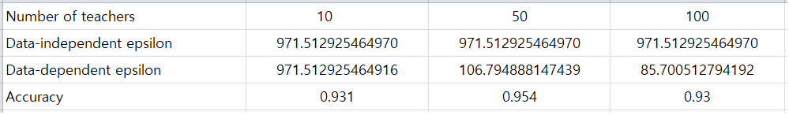

### Project for Application of Differential Privacy with PATE

Differential Privacy (DP) is a criterion of privacy protection in analyzing sensitive personal information.  
For example, by applying DP, a company like Amazon can access personalised shopping preferences while  
hiding sensitive information about historical purchase list.

Private Aggregation of Teacher Ensembles (PATE) was invented to solve the problem of exploiting private  
information from the output of machine learning algorithms. PATE is using DP aggregated outputs of sensitive  
models, called "teachers" (sensitive models are trained directly on labeled sensitive data). The aggregated result  
will be used for training another public model on unlabeled public data,  

We will be using MNIST handwritten digits dataset which consists of 60,000 examples of trainset and 10,000  
examples of testset. For training teacher models, data must be disjoint to preserve the privacy of individual data. 
Therefore, I made disjoint subsets of the MNIST trainset by number of teachers (10, 50, 100) for teacher-model 
training. For prediction on student dataset, 6,000 examples of unlabeled MNIST testset was used.  

To get teachers' prediction, get_teacher_preds(num_teachers, num_examples, epochs) function was written. 
If you wish, you can play with this function for multiple teacher-models. I thought it would be good to save  
predictions for use in case of kernel restart or a new session after the completion of training and prediction   
so that I can skip retraining process. Therefore, I started with making a new directory to contain prediction files 
for each teacher model.

The next process is to load the saved prediction files and get teacher-model predictions by merging the 
loaded files. After getting teacher_preds, I wrote 'aggragate_teacher_preds(epsilon)' function, where epsilon(ε) 
is a metric of privacy loss at a differentially change in data (adding, removing 1 entry). The smaller the 
epsilon value is, the better privacy protection. In this function, the shape of teacher_preds is (50, 6000), 
which is not appropriate for aggregating label_counts. Label_counts is the frequency of digit labels among 
50 teacher_predicted labels. So, teacher_preds was transposed to have a shape of (6000, 50). For differential 
privacy, np.random.laplace() was used to add noise to label_counts, By using np.argmax() on the label_counts, 
we can get a vector of most voted labels (new labels) for student dataset.

With the new labels, we can perform PATE analysis.
 

The input parameters of PATE are: 
- teacher_preds 
- DP-aggregated labels 
- epsilon (privacy loss level) 
- delta (probability that epsilon breaks) 

The output of PATE analysis are:  
- Data-independent epsilon: privacy loss in the worst case 
- Data-dependent epsilon: a tight bound of privacy loss based on real values of teacher models' outputs. 
    
It seems that the upper limit of epsilon value is 0.2 in case of MINIST dataset. When performing PATE analysis 
for epsilon values of 0.3 and above, I got warning message that the epsilon value is too large to compute 
sensitivity, and finally got math error (couldn't get the result). So, I decided to use 0.2 as epsilon value. 
    

For student-model training, I split MNIST testset into 6,000 examples of train_data and 4,000 examples of test_data, 
and redefined the target of student train_data as DP-aggregated labels. As the size of the target tensor is 6,000, the 
data tensor (which was split by batch of 64 examples) was also redefined to make a tensor size of 6,000. Prediction  
was done on the 4,000 examples of MINIST testset. Due to the randomness of Laplacian noise, the test accuracy differs  
whenever rerunning aggerate_teacher_preds() function, but got a test accuracy of around 0.95.  

The following is the result of PATE analyis (epsilon = 0.2) for 3 teacher-models and the test accuracy on the  
student test_data.

    
    

As you can see from the above, the smaller the number of teachers, data-dependent epsilon gets larger, which 
means higher privacy loss. Considering the trade-off between privacy loss and accuracy, 'teachers 50' model 
seems to be the best model I can get as of now. 

    
The value of data-independent/dependent epsilon looks quite large, but one thing to note is that the value is  
determined according to number of examples and epsilon value. I got the above result for 6000 examples with epsilon 
value of 0.2. If I decrease the number of examples to 600, the value will be decreased to 1/10 level, which means 
lower privacy loss, but the accuracy will be decreased, too. Therefore, we need to select an appropriate number of 
examples which does not sacrifice desired accuracy level. In future, I am going to continue testing to find the  
appropriate number of examples.  

My project code was executed on CPU environment of my laptop. Also, I tested my code on GPU environment of  
google colab, and it works fine. Definitely, the training speed on the google colab is much faster than the one 
on CPU environment. If you want to test all 3 models and want to save time, run the 'teachers 50' model first, 
and for 'teachers 10' and 'teachers 100' models, use prediction files that I uploaded. 

<b>Reference: https://towardsdatascience.com/understanding-differential-privacy-85ce191e198a?gi=64f94f61b183<b/> 
