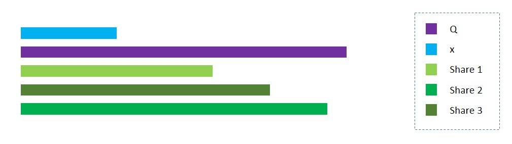
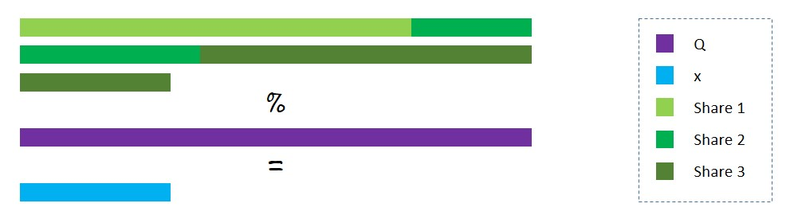

Name: Kapil Chandorikar   
Slack Handle: @Kapil Chandorikar   
Email: kapilchandorikar338@gmail.com   
Abstract: Intuitive and visual explanation of Additive Secret Sharing using PySyft.

# Additive Secret Sharing, Visually
In secret sharing, we split a secret x into a multiple number of shares and distribute them among a group of secret-holders. The secret x can be constructed only when all the shares it was split into are available.   

For example, say we split x into 3 shares: x1, x2, and x3. We randomly initialize the first two shares and calculate the third share as x3 = x - (x1 + x2). We then distribute these shares among 3 secret-holders. The secret remains hidden as each individual holds onto only one share and has no idea of the total value.   

We can make it more secure by choosing the range for the value of the shares. Let Q, a large prime number, be the upper limit. Now the third share, x3, equals Q - (x1 + x2) % Q + x.   

Figure: Encrypting x in three shares.   

The decryption process will be shares summed together modulus Q.   

Figure: Decrypting x from the three shares.

Head over to the [notebook](Additive_Secret_Sharing,_Visually.ipynb) and follow the step by step approach to perform additive secret sharing.  
> In the notebook, each step of the process is explained with visual aids.   

### Tutorial
I have also prepared a Medium post on the project.   
[Introduction to Federated Learning and Privacy Preservation](https://towardsdatascience.com/introduction-to-federated-learning-and-privacy-preservation-75644686b559?source=friends_link&sk=fbfc6f999b21d2cc83c36b4b959b660f), Towards Data Science, Medium

### References
1] Morten Dahl, [Secret Sharing, Part 1](https://mortendahl.github.io/2017/06/04/secret-sharing-part1/), Cryptography and Machine Learning   
2] OpenMind, [PySyft](https://github.com/OpenMined/PySyft/), GitHub   
