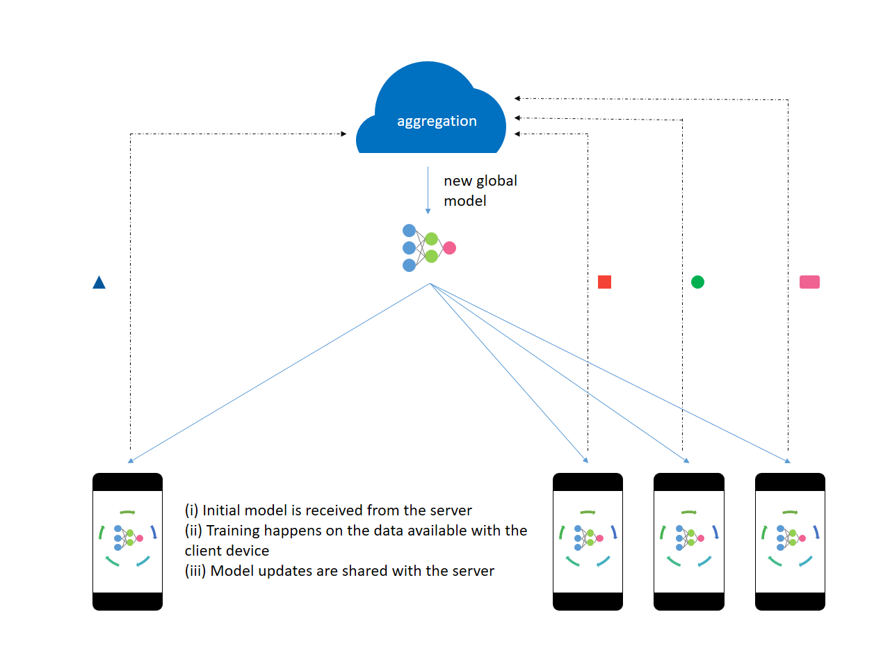

Name: Kapil Chandorikar   
Slack Handle: @Kapil Chandorikar   
Email: kapilchandorikar338@gmail.com   
Abstract: Implementing the federated learning approach to train a simple neural network on the MNIST dataset using the two workers.

# Federated Learning

Federated Learning involves training on a large corpus of high-quality decentralized data present on multiple client devices. The model is trained on client devices and thus there is no need for uploading the user’s data. Keeping the personal data on the client’s device enables them to have direct and physical control of their own data.



The server trains the initial model on proxy data available beforehand. The initial model is sent to a select number of eligible client devices. The eligibility criterion makes sure that the user’s experience is not spoiled in an attempt to train the model. An optimal number of client devices are selected to take part in the training process. After processing the user data, the model updates are shared with the server. The server aggregates these gradients and improves the global model.

All the model updates are processed in memory and persist for a very short period of time on the server. The server then sends the improved model back to the client devices participating in the next round of training. After attaining a desired level of accuracy, the on-device models can be tweaked for the user’s personalization. Then, they are no longer eligible to participate in the training. Throughout the entire process, the data does not leave the client’s device.

### Introducing PySyft
We will use PySyft to implement a federated learning model. PySyft is a Python library for secure and private deep learning.

### Installation
PySyft requires Python >= 3.6 and PyTorch 1.1.0. Make sure you meet these requirements.

```
pip install syft
# In case you encounter an installation error regarding zstd,
# run the below command and then try installing syft again.
# pip install - upgrade - force-reinstall zstd
```

Head over to the [notebook](Federated_Learning.ipynb) and follow the step by step approach to train a model on two workers.

Continue reading for the idea behind federated learning.

### How is this different from decentralized computation?

Federated learning differs from decentralized computation as:
* Client devices (such as smartphones) have limited network bandwidth. They cannot transfer large amounts of data and the upload speed is usually lower than the download speed.
* The client devices are not always available to take part in a training session. Optimal conditions such as charging state, connection to an unmetered Wi-Fi network, idleness, etc. are not always achievable.
* The data present on the device get updated quickly and is not always the same. [Data is not always available.]
* The client devices can choose not to participate in the training.
* The number of client devices available is very large but inconsistent.
* Federated learning incorporates privacy preservation with distributed training and aggregation across a large population.
* The data is usually unbalanced as the data is user-specific and is self-correlated.

> Federated Learning is one instance of the more general approach of “bringing the code to the data, instead of the data to the code” and addresses the fundamental problems of privacy, ownership, and locality of data.

In Federated Learning:
* Certain techniques are used to compress the model updates.
* Quality updates are performed rather than simple gradient steps.
* Noise is added by the server before performing aggregation to obscure the impact of an individual on the learned model. (Global Differential Privacy)
* The gradients updates are clipped if they are too large.

### Tutorial
I have also prepared a Medium post on the project.   
[Introduction to Federated Learning and Privacy Preservation](https://towardsdatascience.com/introduction-to-federated-learning-and-privacy-preservation-75644686b559?source=friends_link&sk=fbfc6f999b21d2cc83c36b4b959b660f), Towards Data Science, Medium

### References
1] Theo Ryffel, Andrew Trask, Morten Dahl, Bobby Wagner, Jason Mancuso, Daniel Rueckert, Jonathan Passerat-Palmbach, [A generic framework for privacy preserving deep learning](https://arxiv.org/abs/1811.04017) (2018), arXiv   
2] Andrew Hard, Kanishka Rao, Rajiv Mathews, Swaroop Ramaswamy, Françoise Beaufays, Sean Augenstein, Hubert Eichner, Chloé Kiddon, Daniel Ramage, [Federated Learning for Mobile Keyboard Prediction](https://arxiv.org/abs/1811.03604) (2019), arXiv   
3] Keith Bonawitz, Hubert Eichner, Wolfgang Grieskamp, Dzmitry Huba, Alex Ingerman, Vladimir Ivanov, Chloe Kiddon, Jakub Konečný, Stefano Mazzocchi, H. Brendan McMahan, Timon Van Overveldt, David Petrou, Daniel Ramage, Jason Roselander, [Towards Federated Learning at Scale: System Design](https://arxiv.org/abs/1811.03604) (2019), arXiv   
4] Brendan McMahan, Daniel Ramage, [Federated Learning: Collaborative Machine Learning without Centralized Training Data](https://arxiv.org/abs/1902.01046) (2017), Google AI Blog   
5] Differential Privacy Team at Apple, [Learning with Privacy at Scale](https://machinelearning.apple.com/2017/12/06/learning-with-privacy-at-scale.html) (2017), Apple Machine Learning Journal   
6] Daniel Ramage, Emily Glanz, [Federated Learning: Machine Learning on Decentralized Data](https://www.youtube.com/watch?v=89BGjQYA0uE) (2019), Google I/O’19   
7] OpenMind, [PySyft](https://github.com/OpenMined/PySyft/), GitHub   
