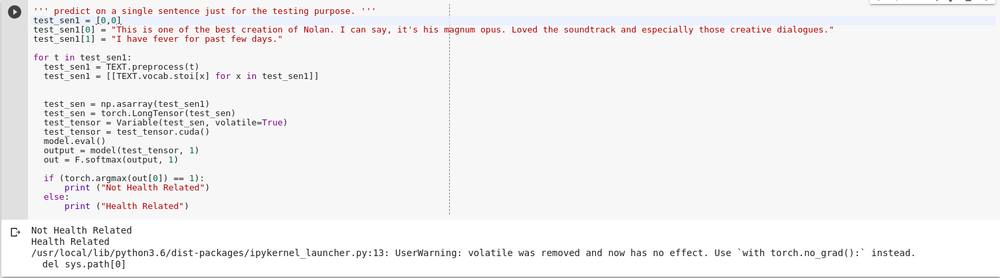
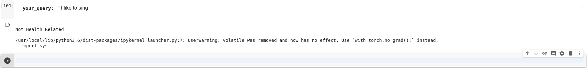
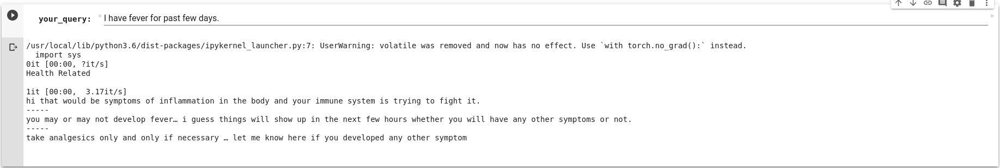

# QuickDocIt: ##
## A health query related chatbot ##

>## Model Architecture: ##
>1. LSTM model (to classify if the query is health-related or not)
>2. Preprocessing (to get all the required keywords) 
>3. DocProduct (BERT Trained on Medical Q&A)
>4. Preprocessing (to select the meaningful response from the set of response)

>## Workflow: ##  
>1. The user speaks/enters the query  
>2. Check if the query is health-related :  
>&nbsp;&nbsp;&nbsp;&nbsp;a. 
>&nbsp;&nbsp;&nbsp;&nbsp;b. 
>3. Do the preprocessing:  
>a. Check if the symptom is present, if not then ask.   
>b. Check if the symptom duration is present, if not then ask.   
>&nbsp;&nbsp;&nbsp;&nbsp;For example, if user query is: __"I had fever"__   
>&nbsp;&nbsp;&nbsp;&nbsp;then, bot will ask for symptom duration: __"From when did this symptom start?"__  
>c. Check if any medicine details are provided, if not then ask.   
>&nbsp;&nbsp;&nbsp;&nbsp;For example, bot query : __"Are you taking any medicine?"__ or __"Any medicine you were taking before?"__  
>d. Check if any medical history details are provided, if not then ask if required.  
>4. Form the query with all parameters and pass it to the DocProduct model for response.  
>5. Do the preprocessing:  
>&nbsp;&nbsp;&nbsp;&nbsp;a. Select the most appropriate response from the list provided by the DocProduct.  
>

### NOTE: The preprocessing part is incomplete. I didn't get time to complete the project and I had to submit as it was the last day. I am truly sorry. ###

>### Things to do:
>1. Preprocessing (at the input and the output of the DocProduct model).
>2. Encrypting the model, data, and response.
