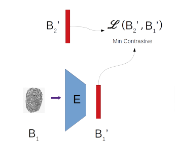

# **Neural Hashmaps**

## **Contributors to the Project**

This is a research project by the team consisting of  

- Rishi S Rao (@Rishi S Rao)
- Laura  (@LauraT)
- Seeratpal K Jaura (@Seeratpal K)
- Vaibhav Patel (@Vebby)
- Aarti Alagammai (@Aarti Alagammai)

The technical details will be available in the arXiv draft, a week from now, the link to which will be updated here in the repository README file.

## **Abstract of the Project**

Cryptographic algorithms have existed for long now and their deployment is very common over internet for everyday purposes. But the challenge comes when the data is of high dimensions and **functional value of the data** becomes more important than the data itself. Very often we may not even require the data but only it's functional value, when we say functional value we mean that the statistical results or results of the operations performed.

To emphasize the importance of the statement it will do great by going through a clear real life example :  
Consider that there is a Authenticator over internet, who has a server, and requires your biometric ( say fingerprint ) for authenticity of your identity. The Authenticator himself may not be trustworthy or for several other reasons ( like his system may not be well protected ) sharing your biometric may not be preferred. The functional value of your data here is being able to perform classification on the data, can we do something such that we need not handover our real data but rather provide an alternative that gives the same ability i.e. perform classification on the alternative provided. 
Here the alternative that we are to handover is an encrypted version of the biometric which we call **hashmap**. The hashmap is unique and at the same time this cannot be used for reproducing the biometric from which it was generated.

Having a handcrafted function that performs homomorphic encryption can solve the issue above as well, but not if the data is from a high dimensional setting or if the number of operatioins on the hashmap is going to be unbounded ( Think of the authenticator using something like Res1000 architecture to perform classification ) the errors introduced on the data will be too high.

An easier way is to let the Neural Networks figure out the encryption procedure, and hence we term our project **Neural Hashmaps**.

## **The Architecture**

We will have a neural network which we call the **Encoder** on every client. This encoder shown below can be learned The above proposed architecture on the client end will enable us to acheive the required properties 
The minimization of contrastive loss helps in creating a unique hashmap. Here B2' is the biometric hashmap of another client sent to the local client from the server and B1' is the biometric hashmap of the local client. By minimizing contrastive loss the hashmaps will become unique as they need to be near in the projected space if they are of the same biometric and farther if they are of different biometrics.

Thus, if the architecture is sucessfully trained we will be able to create a one way function (the encoder is the required function) that can encrypt the data preserving the distance. This biometric hashmap so generated from the encoder can be later used for classification kind of purposes which is the requirement of the server.

## **Goals reached and problems faced**

The current architecture that has been trained and submitted, performs well on various grounds, but more importantly proves that such a function can be learnt.

The various plots in the notebook shows the performance of the architecture and the discriminator used at server end it is noted that even for small number of classes with large enough sampling the discriminator model does not achieve reliable accuracies, the current reported accuracies are only 82% at max.

Moreover we have come with adversarial attacks on these models that break through using the loop holes in the paradigm of our learning.

## **Work that is being published**

We are currently finishing up with three important things that will be featured in the research paper:
1. Theoretical guarantees that such a model is 
    a. irrevertible 
    b. can be learnt 
    c. and preserves the functional value of the data  
2. The extension model (we are to test our hypothesis) that can thwart the adversarial attacks we envisioned.  
3. The extension model being worked on also surpasses greatly the current model in server side discriminator accuracy with very low samples per class ratio.

