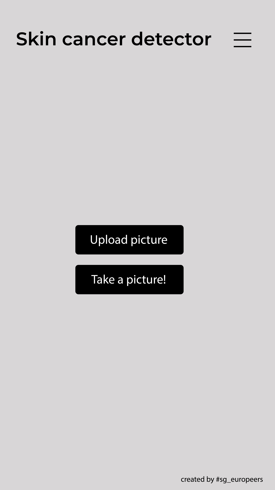
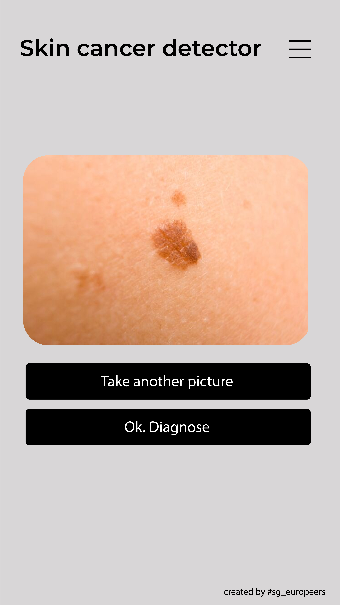
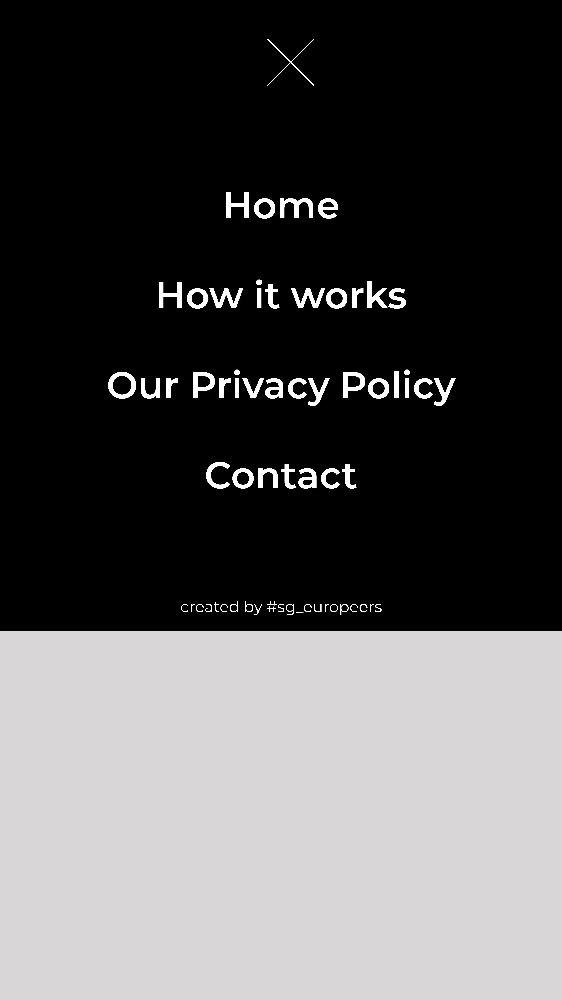

# Federated Learning image classifier as final project for Secure and Private AI Course

### Aim:   
Our aim is to create an Android app that users can use to take photos of marks or spots on their skin in order to identify whether the mark was a sign of skin cancer and the person should go and seek more specialist diagnosis. All photos of a person’s skin would be protected by federated learning privacy techniques.

### Project Steps:   
To verify the compatibility of using pre-trained models with PySyft Federated Learning. Our notebook reflects our attempts at creating an image classifier model with a starting point of using a pre-trained model like resnet50 to speed up the accuracy of the model from the start.

To test our approach we have been using the Dog v Cat dataset which is readily available for download from microsoft here.
https://download.microsoft.com/download/3/E/1/3E1C3F21-ECDB-4869-8368-6DEBA77B919F/kagglecatsanddogs_3367a.zip

We have been found difficulties in using a pre-trained model with PySyft. So, we have created our own CNN architecture from scratch to demonstrate that we are able to implement federated learning with an Image CNN classifier.

We will continue to go forward with the project.

### Future steps:   
1. Obtain a dataset with skin cancer images for use in training the model.
2. Develop code to use transfer learning in order to have a robust model to start the model training on skin images.
3. Develop python scripts of model.
4. Develop an android app to deploy python scripts of the model.

### Team Members

| Name | Slack |
| ------ | ------ |
| Paul Stancliffe       | @PaulBruce |
| Enrico Aymerich       | @Chetto13  |
| Alejandro Domínguez   | @AlexDL    |

The team is the result of synergies that have taken place in the #sg_europeers Study Group. We are a team of 3 people, coming from different countries in Europe. You can reach us out in the community Slack Workspace.

### Android app under development
The idea for the app consists of 4 main screens:

- Screen 1: the user arrives to the main screen where it has two buttons, depending on whether he/she wants to "Upload an existing picture from the gallery" or "Take a picture" at that moment.

- Screen 2: when the user has the desired photo, the app shows the selected/taken image with two options: If you are okay with the photo you chose or took, go ahead and let the algorithm give a diagnosis ... or if you want to change it, you can take another picture.

- Screen 3: this would show the diagnosis by the model run by the app.

- Screen 4: there would always be a menu available to the user, where he/she could find information regarding the privacy techniques we have used to protect any diagnosis being made, and how the app works.

In the next screenshots you can see a draft version of the result!     

  
