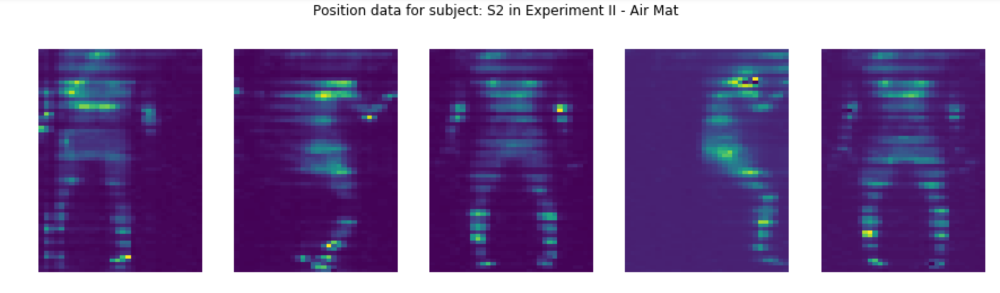
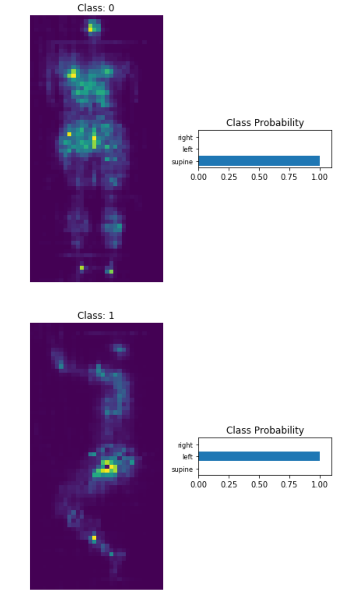
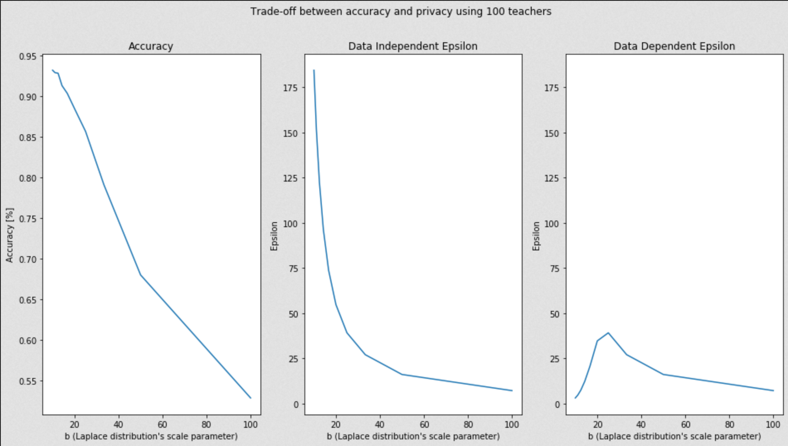

# Private In-bed Posture Classification on a Pressure Map Dataset

---
**NOTE**

This file is the entry summary for the Project Showcase Challenge and contains only the README.md file, where an overview of the project is given.

The [group repository](https://github.com/Fustincho/Private-In-bed-Posture-Classification) containing all notebooks, detailed descriptions, and code is found here:

[https://github.com/Fustincho/Private-In-bed-Posture-Classification](https://github.com/Fustincho/Private-In-bed-Posture-Classification)

---

## Authors (`@Slack_IDs`, `GitHub_Username`):

+ Agustín Vargas Toro (`@Fustincho`, [Fustincho](https://github.com/Fustincho))
+ Alejandro Aristizábal Medina (`@Alejandro Aristizábal`, [aristizabal95](https://github.com/aristizabal95))
+ Luis Antonio Aguilar Gutiérrez (`@Antonio`, [LsAntonio](https://github.com/LsAntonio))

## Motivation

This short project serves as a demonstration of the techniques taught in the course material of the **Secure and Private AI Challenge**, hosted by Udacity and sponsored by Facebook (May - August, 2019) and as an entry of several members of the Latin American study group to the *Project Showcase* event in the frame of the previous mentioned challenge.


The course material gives an introduction of Deep Learning (DL) techniques using *[PyTorch](https://pytorch.org)* and explores a relatively new framework designed for privacy preserving deep learning: *PySyft* ([Ryffel et. al, 2018](https://arxiv.org/abs/1811.04017)).

The choice of a dataset to work on is not a trivial task, as there is a great amount of publicly available data to work on and we had the freedom to choose any dataset to make a 'showcase' project. We selected a [Pressure Map Dataset for In-bed Posture Classification](https://physionet.org/content/pmd/1.0.0/). This dataset is the product of a study conducted in two separate experimental sessions from 13 participants in various sleeping postures using several commercial pressure mats ([Pouyan et. al, 2017](https://ieeexplore.ieee.org/document/7897206/)). We saw the following advantages by choosing this dataset:

+ A relevant dataset in the medical sector, as monitoring in-bed postures is relevant to both prevent any deterioration of the skin of patients who are unable to move frequently (by detecting when patients stay in the same position for a long time), as well as a way of analyzing sleep quality of patients ([Pouyan et. al, 2017](https://ieeexplore.ieee.org/document/7897206/)).

+ A 'small' size (~107 MB) dataset that allowed us to apply the course content efficiently, due to the expected time of realization of the project (~3 weeks, including planning).

+  A rich (in terms of the amount of subjects who participated in the data collection and the fact that more than one pressure mat was used for data collection) dataset that allowed us to simulate real use-case scenarios using privacy preserving methods learned in the course.

Additionally, we use this project as a **proof of concept** to exemplify a potential health care scenario, where Deep Learning (DL) is a potential solution for many problems in that area, but at the same time demands that any DL method ensures the privacy of the patients. While [Pouyan et. al, 2017](https://ieeexplore.ieee.org/document/7897206/) described potential applications for the type of data we are using, pressure readings on a mat can also lead to obtain sensitive information (for example an estimation of the body mass, corpulence and sleep habits) and it is mandatory for hospitals to ensure that the data remains private and that no external attacker can access to it.

## Downloading the dataset

The dataset is publicly available and hosted by the [Physionet](https://physionet.org) databank [here](https://physionet.org/content/pmd/1.0.0/). We introduce the data download in our first notebook but we also present the chunk here as a matter of completeness:

```bash
wget https://physionet.org/static/published-projects/pmd/a-pressure-map-dataset-for-in-bed-posture-classification-1.0.0.zip
unzip -q a-pressure-map-dataset-for-in-bed-posture-classification-1.0.0.zip
mv a-pressure-map-dataset-for-in-bed-posture-classification-1.0.0 dataset
```

## Justification

Deep Learning models are used to learn useful representations from a wide variety of data. This data contains useful information about a specific phenomena. In some contexts, data might contain sensitive information that data owners would not like to share with others.

Nonetheless, traditional methods to ensure privacy (e.g., data anonymization) as well as traditional learning strategies (e.g., training a neural network via backpropagation) are proven to be insufficient to preserve privacy. Here we mention two examples:

+ Anonymized datasets can be de-anonymized via *linkage attacks* by combining knowledge of other databases on the one that has been anonymized. A famous case is documented in the article of [Narayanan et. al (2006)](https://arxiv.org/abs/cs/0610105), where they break anonymity of entries in the Netflix Prize Dataset via statistical de-anonymization attacks against high-dimensional micro-data.

+ Besides attacking the data itself, models can also be exploited. Models learn representation, and such representation can be exploited as well. For example, [Fredrikson et. al (2015)](https://www.cs.cmu.edu/~mfredrik/papers/fjr2015ccs.pdf) 'attacked' a computer vision classifier by using hill climbing on the output probabilities and were able to reveal individual faces used on the training phase.

These results, among many others, have lead to the development of privacy-preserving techniques when learning on data such as Differential Privacy and Federated Learning. These techniques aim to assure the integrity of the model and data, guaranteeing in this way a degree of safety for the data owners and users.

These techniques add several layers of privacy to the data and model. Hence, by applying them we can safely train and deploy the models, without compromising the user privacy. In this project, we show how to apply some of these techniques, namely: Private Aggregation of Teacher Ensembles (PATE) and Encrypted Federated Learning.

We begin by performing an explorative data analysis on the dataset. Then, we propose a model to classify the images, where no private techniques were added. Next, we show how privacy can be guaranteed via a learning strategy called Private Aggregation of Teacher Ensembles (PATE). Finally, we use Encrypted Federated Learning to show the potential of building a model on a simulated hospital scenario, where the encryption techniques ensure that no third parties can see the raw data of the sensor measurements.

## Content

This project is presented as a set of notebooks dedicated to specific topics of the project. It is intended to follow them in order, as there are elements that are defined in the first notebooks and used again posterior ones (e.g., data download, data load, model definition).

**NOTE: This section presents an overview of the topics that are present on each of the notebooks and are by no means a fully detailed description of the work done. We describe in detail the problem and our approaches in each one of the notebooks. Conclusions are described at the end of each notebook.**

The project is divided into four parts:

+ **Part 1 - Introduction and Exploratory Data Analysis**

In this section we introduce the dataset used in this project, create the functions to read the data and inspect visually the target classes. Additionally, we count the number of labels per class and analyze the difference between the two experiments made by the authors of the dataset. Finally we create a basic neural network to test the viability of classifying the postures.



+ **Part 2 - In-Bed posture classification using CNN**

This part is dedicated to build a model dedicated to classify the human in-bed positions. We create a Convolutional Neural Network to solve this task and we analyze via cross-validation a non overestimated accuracy. Our results show a greater accuracy with respect to the author's model, who used manual feature extraction to create vector inputs for a neural network. Now that the model is ready, we focus on the remaining two parts on ensuring privacy for our setting.




+ **Part 3 - Achieving Privacy with Private Aggregation of Teacher Ensembles (PATE)**

In this section we implement a training strategy that ensures privacy, called PATE, which was introduced by Papernot et al (2017) on their paper [Semi-supervised knowledge transfer for Deep Learning from private training data](https://arxiv.org/abs/1610.05755). Additionally, we use an utility function from [PySyft](https://github.com/OpenMined/PySyft), a library for encrypted, privacy preserving deep learning, that allow us to analyze our PATE implementation and know how private our learning strategy is.



+ **Part 4 - Encrypted Federated Learning using PySyft**

Federated Learning is a recent approach to machine learning on distributed datasets. This technique, proposed by McMahan et al.(2016) on the paper [Federated Optimization: Distributed Machine Learning for On-Device Intelligence](https://arxiv.org/pdf/1610.02527.pdf), allows to train a model without the need of retrieving the data from its original location. Federated Learning “improves privacy and security risks by limiting the attack surface to only the device, rather than the device and the cloud” (McMahan et al. 2016). Additionally, it allows companies to develop AI products while staying in compliance with GDPR [(Yang et al. 2019)](https://arxiv.org/pdf/1902.04885).

In this section we use the dataset to simulate a scenario in which all subjects contain their data inside their own devices. By using Encrypted Federated Learning, we are able to train a global model by doing Private Model Averaging, without the need to retrieve the private data from the subjects.

## Library versions

We did this project using Python version 3.6.8. Here we list the most important libraries that we used:

| Library  | Version |
|----------|---------|
| pytorch  | 1.1.0   |
| numpy    | 1.16.4  |
| matplotlib | 3.1.0 |
| torchvision | 0.3.0 |
| syft | 0.1.23 |
