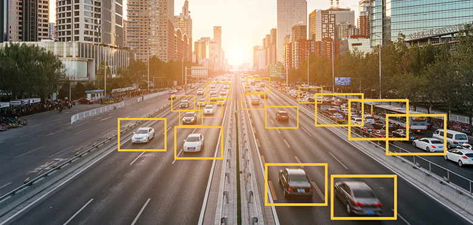
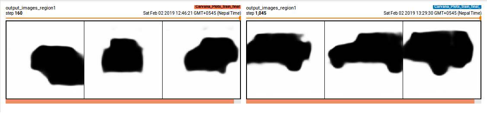

# Smart Traffic Monitoring and Management using Deep Learning

Traffic management has been a major issue in big cities like New York to Kathmandu. The number of population and so is the number of vehicles used by those people are also increasing. It has been a very recondite matter to resolve. Increasing the infrastructures like road might be one option but that's not the only one. Instead of scaling up in infrastructures to meet the requirements, we can also use the existing infrastructures efficiently which would prove to be much more useful and feasible for the developing countries with poor economic status.

_Source: https://www.hindustantimes.com/rf/image_size_960x540/HT/p2/2018/06/08/Pictures/lajpat-nagar-flyover-repair-work_125caef6-6ac4-11e8-af35-5e950c6035ab.jpg_

For this purpose, I have thought of using the deep learning and machine learning techniques. Instead of following a shortest route to a location and getting stuck in the traffic wasting hours, what if route the vehicles in a dynamic and smart way such that the available infrastructures are optimally used with minimum increment in the distance to be travelled by the public? It would require detecting vehicles, calculating the traffic at every places and planning a path routing the traffic through different path. Camera feed from every location will be used as input for the system.

_Source: https://www.axis.com/blog/secure-insights/wp-content/uploads/sites/11/2019/02/traffic_deep_learning_cameras_detection.jpg_

For detecting the vehicles, we can use object detection but using localization or segmentation might provide us with much more rich information that will be helpful for monitoring. I have included the code for segmentation in which I have used Feature Pyramidal Network and trained in the Carvana DataSet. It is based on Pytorch and also includes code for the visualtization of the training process of every batch and the segmentation results which used tensorboardX. With this information we will be able to keep track of and monitor every vehicles. This information can be used in multifarious ways and is only limited by our imagination. One of the application that I mentioned will be to route the traffic in smart way. Another useful application can be used to monitor every vehicle and make sure that none of them are violating the rules. Similarly another can be to control the traffic lights in a smart way depending upon the traffic.

## Visualization using Tensorboard

### Mask Label

### Mask Predicted

In order to use tensorboard use __tensorboard --logdir runs --port 8000__

I have tried to use the knowledge that I learned during this time of the course along with my colleagues to put the power of artificial intelligence and machine learning to good use.