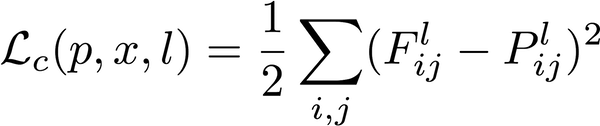
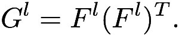
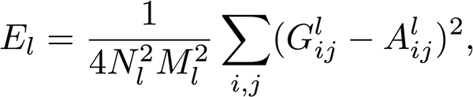
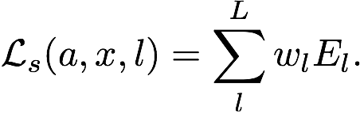
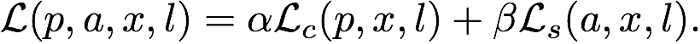
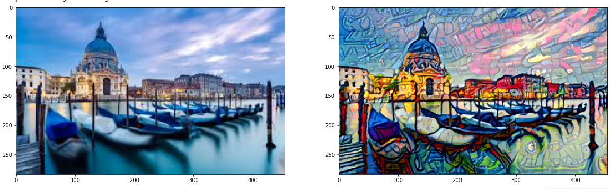

<h1 align="center">Neural Style Transfer Learning </h1>

## What is Neural Style Transfer learning?

Neural style transfer is an optimization technique used to take three images, a content image, a style reference image (such as an artwork by a famous painter), and the input image you want to style — and blend them together such that the input image is transformed to look like the content image, but “painted” in the style of the style image.

Let's consider these content and style reference images:- 

</img>

After doing some magic of neural style transfer learning the image we obtain:-

</img>

The whole concept involves playing with some distances and loss functions so what we do is make the loss of style and content images such that they can form a blend of images to be seen.

The principle of neural style transfer is to define two distance functions, one that describes how different the content of two images are, Lcontent, and one that describes the difference between the two images in terms of their style, Lstyle. Then, given three images, a desired style image, a desired content image, and the input image (initialized with the content image), we try to transform the input image to minimize the content distance with the content image and its style distance with the style image.

### Content Loss

The purpose of the content loss is to make sure that the generated image x retains some of the “global” characteristics of the content image, p. 

To achieve this, the content loss function is defined as the mean squared error between the feature representations of p and x, respectively, at a given layer l.

</img>

Here,

    F and P are matrices with a number of rows equal to N and a number of columns equal to M
    N is the number of filters in layer l and M is the number of spatial elements in the feature map (height times width) for layer l
    F contains the feature representation of x for layer l
    P contains the feature representation of p for layer l

### Style Loss

On the other hand, the style loss is designed to preserve stylistic characteristics of the style image, a. Rather than using the difference between feature representations, the authors use the the difference between Gram matrices from selected layers, where the Gram matrix is defined as:

</img>

The Gram matrix is a square matrix that contains the dot products between each vectorized filter in layer l. The Gram matrix can therefore be thought of as a non-normalized correlation matrix for filters in layer l.

## Style loss

</img>

where A is the Gram matrix for the style image a and G is the Gram matrix for the generated image x.

To create a smooth blending between these different layers, we can assign a weight w to each layer, and define the total style loss as:

</img>

## Total loss

</img>

According to authors a=1 and b=10,000

After doing the Style Transformation Image obtained is

</img>
