# Project Showcase Challenge
**Author**: Shuyan Huang   
**Date**: August 17th, 2019

## Introduction

Neural Network and Deep Learning are becoming more popular and widely employed in the field of healthcare. This project is to practice implementing various types of neural networks with Epileptic Seizure Recognition Data Set.

## Dataset

For this project, I used Epileptic Seizure Recognition Data Set fetched from UCI Machine Learning Repository. The datasets are too large to be uploaded to Github. But on my local disk, I have a repository of data/seizure, inside which there are three files: seizure_train.csv, seizure_test.csv and seizure_validation.csv. Each file contains a header at the first line, and each line represent a single EEG record of 178 data points with its label at the last column. Each data point is the value of the EEG recording at a different point in time. Here is an example:   

X1, X2, … … , X178, y

-98, -110, … …, 64, 3

-51, -23, … …, 148, 5

The column y contains the category of the 178-dimensional vector. There are five categories including: Seizure, TumorArea, HealthyArea, EyesClosed and EyesOpen. Seizure means recording of seizure activity; TumorArea means the EEG recording from the area where the tumor was located; HealthyArea means they identify the tumor location in the brain and record the EGG activity of the healthy brain area; EyesClosed means EEG recording of patients with their eyes closes; EyesOpen means EEG recording of patients with their eyes open [1].

## Calculations

In order to better understand neural networks, I calculated the number of trainable parameters and the number of computations for multi-payer perceptron, convolutional neural network and recurrent neural network, respectively. We have 178 features in total, so calculations are as below:

### Multi-layer perceptron

**Number of parameters:**

- From input layer to hidden layer, 178 features need 178 weights(w), 1 bias b and there are 16 units in hidden layer. So, the number of parameters = (178 + 1) * 16 = 2864. 
- From hidden layer to output layer, 16 units need 16 weights, 1 bias and there are 5 units in output layer. So, the number of parameters = (16 + 1) * 5 = 85. 

Therefore, the total number of “trainable” parameters = 2864+ 85 = 2949.

**Number of computations:**
- From input layer to hidden layer, the linear formula is y = WX + b, while we have 178 features(x). So, we need 178 multiplications and 178 additions (177 for w and 1 for b). Besides, we have a sigmoid activation function 1/(1+e^(-x) )  which involves 1 subtraction, 1 exponentiation, 1 addition and 1 division. Therefore, for single unit, we need 178 + 178 + 4 = 360. Since we have 16 units in the hidden layer, the number of computations = 16 * 360 = 5760.
- From hidden layer to output layer, the formula is still y = WX + b, while we have 16 input. So, we need 16 multiplications and 16 additions. Since we have 5 units, the number of computations = 5 * (16 + 16) = 160.

Therefore, the total number of computations = 5760 + 160 = 5920.

Note: I neglected the softmax activation function which is built in loss function.

### Convolutional Neural Network (CNN)
**Number of parameters:**
- For the first convolution layer, a kernel with size of 5 needs 5 weights and 1 bias. Since parameters are shared in one channel, parameters needed for the 6 channels are: (5 + 1) * 6 = 36.
- No parameter is needed for pooling layers.
- For the second convolution layer, there are 6 input channels and 16 out channels, so: (5 * 6 + 1) * 16 = 496.
- For the two fully connected layers, calculations are same as what I did for MLP: (41 * 16 + 1) * 128 + (128 + 1) * 5 = 84741.

Therefore, the total number of variables = 36 + 496 + 84741 = 85273.

**Number of computations:**
- For the first convolution layer, one move of the filter involves 5 multiplications, 4 additions. Besides, there are 2 computations (1 comparison and 1 multiplication) for ReLU. We have 6 filters and 174 moves for each filter, so the number of computations = 6 * 174 * (5 + 4 + 2) = 11484.
- For the first pooling layer, we have (174 / 2) * 6 comparisons, which is 522 computations. 
- For the second convolution layer, we have 6 input channels. Like the first convolution layer, one move of a filter involves 5 * 6 = 30 multiplications, (5 * 6 – 1) = 29 additions. Besides, there are 2 computations (1 comparison and 1 multiplication) for ReLU. We have 16 filters and 83 moves for each filter, so the number of computations = 16 * 83 * (30 + 29 + 2) = 81008.
- For the second pooling layer, we have (83 / 2) * 16 comparisons, which is 656 computations. 
- For the first fully connected layer, we have 41 * 16 multiplications, 41 * 16 additions and 2 computations for ReLU for each unit. Since there are 128 units, the number of computations = (41 * 16 * 2 + 2) * 128 = 168192.
- For the second fully connected layer, we have 5 units and 128 multiplications, 128 additions for each unit. The number of computations = 128 * 2 * 5 = 1280.

Therefore, the total number of computations = 11484 + 522 + 81008 + 656 + 168192 + 1280 = 263142.

### Recurrent Neural Network (RNN)
According to the paper of Rahul Dey and Fathi M. Salem [2], for the recurrent hidden state of RNN, 

    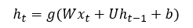

while W is an n * m matrix, U is an n * n matrix and b is an n * 1 matrix (or vector). Therefore, the parameters needed for the hidden state is: n * m + n * n + n * 1 = n2 + nm + n. 
The GRU RNN model is represented in the form:

    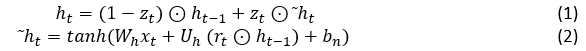

with the two gates presented as:

    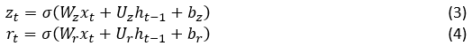

Since Wh, Wz and Wz are different weight matrices, number of parameters needed for W is 3 * n * m. Similarly, U needs 3 * n * n and b needs 3 * n * 1 parameters. Therefore, the total number of parameters for the GRU layer should be 3 * (n2 + nm + n).     
  

**Number of parameters:**
- In our case, n = 16 and m =1. So, the number of parameters needed for GRU layer = 3 * (162 + 16 * 1 + 16) = 864. 
- The number of parameters needed for the fully connected layer = 5 *(16 + 1) = 85.

In total, there are 864 + 85 = 949 trainable parameters. 

**Number of computations:**   
I assume sigmoid and tanh involve 4 operations separately.
- In equation (3), there are 1 multiplication * 16 from Wzxt , (16 multiplications + 15 additions) * 16 from Uzh(t-1) , 16 * 2 additions from the plus signs in Wzxt + Uzh(t-1) + bz , and 16 * 4 from sigmoid operations. So, we have 1 * 16 + (16 + 15) * 16 + 16 * 2 + 16 * 4 = 608 computations. Since we have 178 features, we then have 608 * 178 = 108064 computations.
- Same number of computations (608) for equation (4).
- In equation (2), there are 1 multiplication * 16 from Whxt , (16 multiplications + 15 additions + 1 element wise multiplications) * 16 from Uh (rt ⊙ h(t-1) ), 16 * 2 additions from the plus signs in Whxt + Uh (rt ⊙ h(t-1) ) + bn , 16 * 4 from tanh operation. So, we have 1 * 16 + (16 + 15 + 1) * 16 + 16 * 2 + 16 * 4 = 624 computations. Since we have 178 features, we then have 624 * 178 = 111072 computations.
- In equation (1), there are 16 subtractions and 16 additions from minus and plus signs in (1 - zt ) ⊙ h(t-1) + zt ⊙ ̃ht    , also there are 2 * 16 element wise multiplications from ⊙ signs. So, we have 16 + 16 + 2 * 16 = 64 computations. Since we have 178 features, we then have 64 * 178 = 11392 computations.
- For the fully connected layer, we have 5 units and 16 multiplications, 16 additions for each unit. The number of computations = 16 * 2 * 5 = 160.

In total, the number of computations = 108064 * 2 + 111072 + 11392 + 160 = 338752.

## Data Loading
I loaded the raw dataset files and convert them into a PyTorch TensorDataset. There are three models applying different types of neural networks and each of them requires a different input format. In that case, I needed to convert the raw data accordingly. Below is the function that I wrote to load and convert the data:

    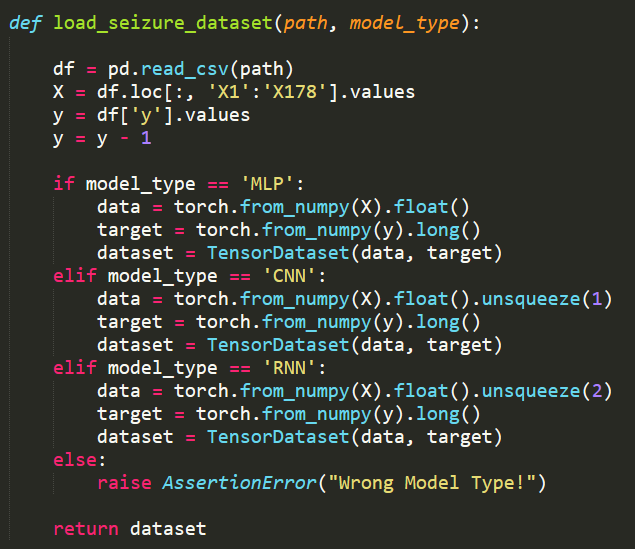

## Neural Networks

### Multi-layer perceptron (MLP)

I implemented a 3-layer MLP that is similar to the below figure. The hidden layer is consisted of 16 hidden units followed by a sigmoid activation function.

    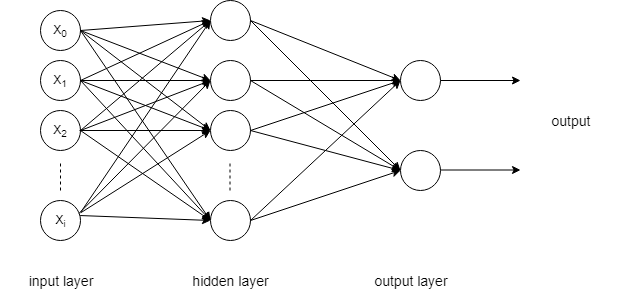

The codes for MLP class is as:
  

    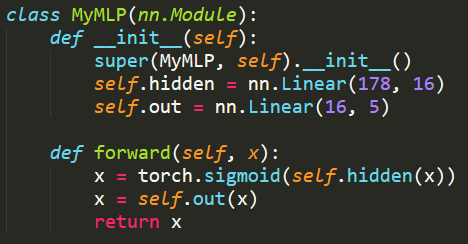

### Convolutional Neural Network (CNN)
I implemented a CNN model that is similar to the below structure. There are two convolutional layers, one of which has 6 filters with kernel size 5 and stride 1 while ther other one has 16 filters with kernel size 5 and stride 1. Every convolutional layer was followed by a max pooling layer with size of 2. Then there were two fully connected layers. One has 128 hidden units while the other one has 5 units. Activation function in this model was Rectified Linear Unit (ReLU).

    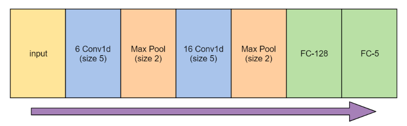

The codes for CNN class is as: 
  

    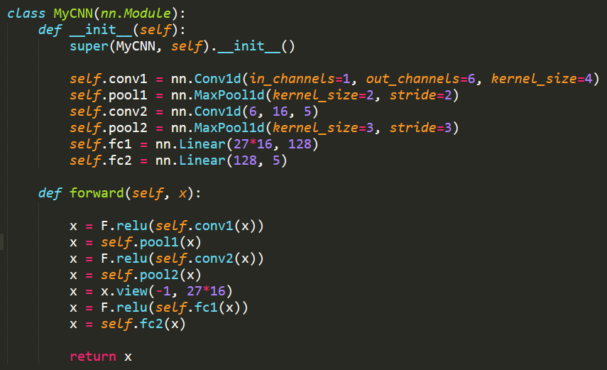

### Recurrent Neural Network (RNN)
I implemented a RNN model with a Gated Recurrent Unit (GRU) followed by a fully connected layer. The structure was similar to below:

    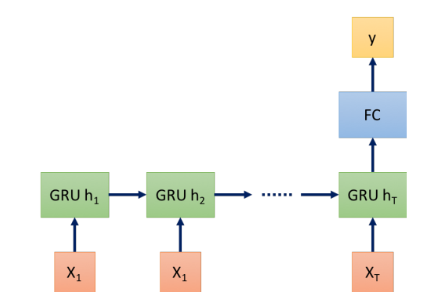

The codes for RNN class is as:
   

    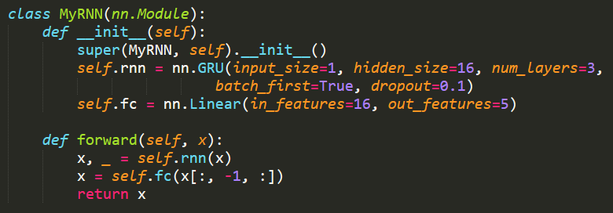

## Results
To monitor whether the model is trained well or not, I tracked the loss and accuracy change over the training iterations. For this project, I used Cross Entropy loss function.

After model training, the model performance was evaluated on the validation dataset. I chose Confusion Matrix as the performance metrics. 

### Multi-layer perceptron (MLP)
The loss curves and accuracy curves with epoch number of 10 are as shown in Figure 1. We can see from the plots that the loss did not decrease much and accuracy stayed at a very low level, for both training and validation datasets.

    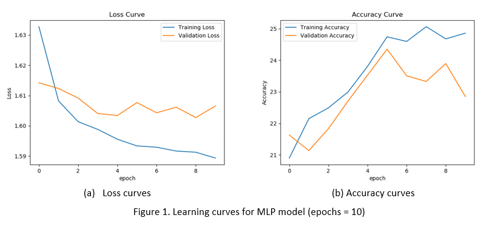

From the plots in Figure 1, we can see the model seems to overfit after epoch = 5 (accuracy started to decrease for validation data). So, I set epochs numbers to be 5 here. The confusion matrix plot is shown in Figure 2. The plot shows that the model does not work well for our test data.

    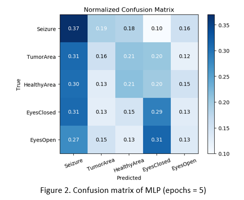

Then I modified the model to improve performance and my best MLP model has 4 layers. Besides the input and output layers, there are 2 hidden layers composed by 160 and 16 units separately. Each hidden layer is followed by Scaled Exponential Linear Unit (SeLU) activation. The loss curves and accuracy curves with epoch number of 15 are as shown in Figure 3. Compared to Figure 2, validation accuracy increased from 24% to 65% approximately. We can see loss and accuracy seem to converge at around epoch = 8. So, I set number of epochs to be 8. The confusion matrix plot is shown in Figure 4. Compared to Figure 2, the performance on test dataset has been highly improved. It is because more hidden layers result in higher computation capacity. At the same time, SeLU function has no problem with vanishing gradients and learn faster and better than other activation functions.

    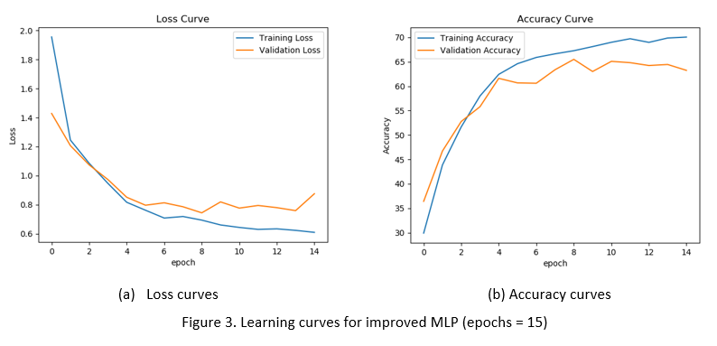

    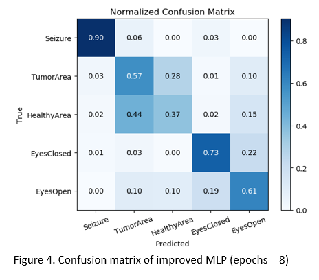

### Convolutional Neural Network (CNN)
The loss curves and accuracy curves with epoch number of 10 are as shown in Figure 5. We can see the accuracy seems to converge and validation loss starts to increase at around epoch = 4. So, I set number of epochs to be 4. The confusion matrix plot is shown in Figure 6.

    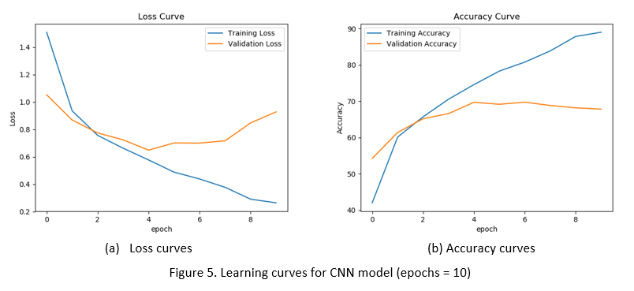

    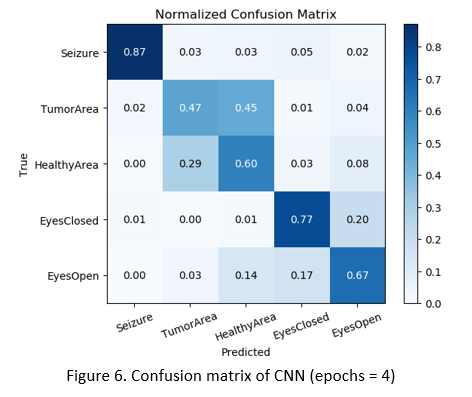

My best improved CNN model has two convolutional layers, one with 6 filters of the kernel size 4 (stride 1) and the other one with 16 filters with the kernel size 5 (stride 1), and they followed by Rectified Linear Unit (ReLU) activation. The first convolutional layer (after ReLU activation) is followed by a max pooling layer with the size (as well as stride) of 2. The second convolutional layer (after ReLU activation) is followed by a max pooling layer with size (as well as stride) of 3. There are two fully-connected (aka dense) layer, one with 128 hidden units followed by ReLU activation and the other one is the output layer that has 5 units.
The loss curves and accuracy curves with epoch number of 10 are as shown in Figure 7. Compared to Figure 5, loss and accuracy are improved a little but not much. However, this is the best model I can get by now. It seems that the loss started to increase, and accuracy converges at epoch = 6. So, I set number of epochs to be 6. The confusion matrix plot is shown in Figure 8. Compared to Figure 6, prediction of all classes except “TumorArea” has been improved. The reason for the improvement could be that the new set of kernel size and stride are doing better in revealing characteristics of this dataset. 

    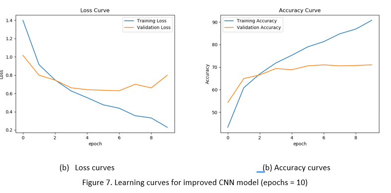

    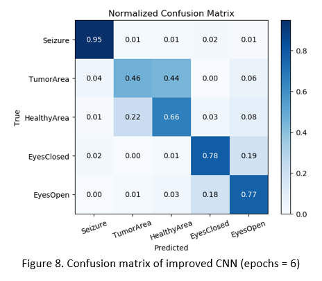

### Recurrent Neural Network (RNN)
The loss curves and accuracy curves with epoch number of 250 are as shown in Figure 9. We can see loss and accuracy seem to converge at around epoch = 150. So, I set number of epochs to be 150. The confusion matrix plot is shown in Figure 10.

    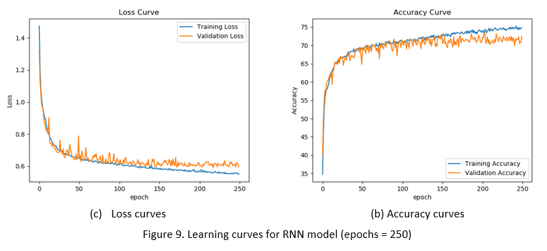

    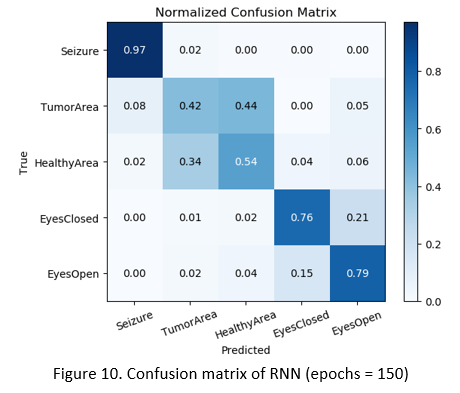

My best RNN model keeps the GRU layer with 16 hidden units and one fully-connected layer connecting the hidden units of GRU to the output units. But I changed num_layers for GRU from 1 to 3 and use dropout as 0.1. The loss curves and accuracy curves with epoch number of 250 are as shown in Figure 11. Compared to Figure 9, loss and accuracy are improved a little. It seems that the loss and accuracy converge at epoch = 100. So, I set number of epochs to be 100. The confusion matrix plot is shown in Figure 12. Compared to Figure 10, predictions of “TumorArea” and “HealthyArea” have been improved. 

    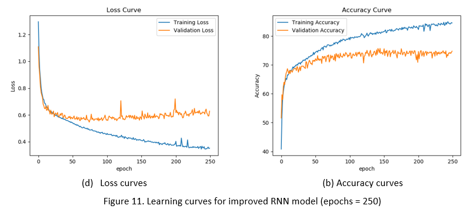

    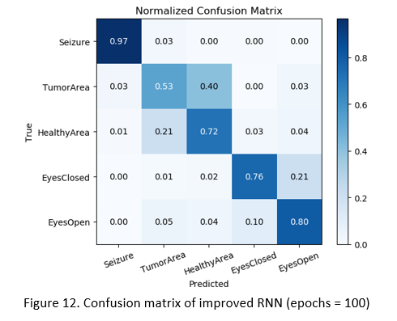

## References:
[1] Andrzejak RG, Lehnertz K, Rieke C, Mormann F, David P, Elger CE (2001) Indications of nonlinear deterministic and finite dimensional structures in time series of brain electrical activity: Dependence on recording region and brain state, Phys. Rev. E, 64, 061907    
[2] Rahul Dey and Fathi M. Salem. Gate-Variants of Gated Recurrent Unit (GRU) Neural Networks. IEEE 60th International Midwest Symposium on Circuits and Systems (MWSCAS). 2017.
