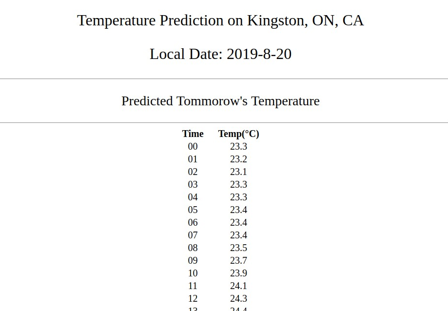

# Temperature Forecast Web Application  

- This app predicts the next day's temperature on Kingston, ON, CA from last 480 hours data

    1) Data Source  
    [Canada Government's historical weather data](http://climate.weather.gc.ca/historical_data/search_historic_data_e.html) collected  
    Weather Station: Kingston Climate
    
    2) Framework  
    PyTorch framework
    
    3) Model  
    LSTM model trained on data of station "Kingston Climate", 2015.1.1 ~ 2019.8.7  
    Input: 480 hours of data (8 features: temperature, dew point temperature, relative humidity, and so on)  
    Output: a temperature of 24 hours later  
    
    4) FLASK API for backend  

- Notebooks that explain the detailed processes from data-collection to prediction  
    1) [Process Data](https://github.com/sijoonlee/deep_learning/blob/master/rnn-weather-forcast-kingston/data_processing_v2.ipynb)  
    2) [Build and Train Model](https://github.com/sijoonlee/deep_learning/blob/master/rnn-weather-forcast-kingston/build_and_save_model_v2.ipynb)  
    3) [Load Model and Predict](https://github.com/sijoonlee/deep_learning/blob/master/rnn-weather-forcast-kingston/prediction_v2.ipynb)  

- Screenshot  
  

- Requirements  
```
numpy==1.16.2
Flask_RESTful==0.3.7
torch==1.1.0
timezonefinder==4.1.0
pytz==2018.7
Flask==1.0.2
pandas==0.23.4
```

- How to Run (Linux)  
type commands below and run browser on http://127.0.0.1:5000/   
```
export FLASK_APP=app
flask run
```


