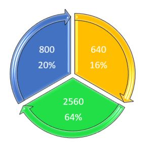

# Smog Detection Project

A project by **Planet-Earth** (#sg_planetearth) study group in Facebook Secure and Private AI Scholarship Challenge 2019.  
**_Check out our web-app we have deployed at [smog4000.onrender.com](https://smog4000.onrender.com/). At this site, you can upload your street/highway images and test the accuracy of our classification system._** Although it works on all images, you can get the best results on highway images.

___
## Part 1: Project Summary

### Description:
Smog Detection project has been created as a collaborative team effort between 
Facebook Secure and Private AI Scholars on #sg_planetearth. The main focus of the group is to provide Deep Learning solutions to solve most concerning real-world problems, such as Climate Change, Food Security, Plastic Pollution, Deep Fake, Oceanic Pollution, Industrial Nuclear Waste, Clean Energy and more(using AI for social good). Currently, our team is focusing on Smog and Fog detection on highways.</br>

### Why is it important? Why should we care?
The sudden appearance of smog and/or fog on the highway more often than not causes serious and sometimes fatal accidents. Smog is the main agent for severe air pollution. It can aggravate health problems including problems with breathing and sleeping, as well as it can inversely damage plants and forest cover.</br> 

### Solution
Monitoring, early smog detection, and preventive action. By using traffic cameras and train a model to recognize the smog/fog patterns, we can automate the alert and send a notification promptly. When smog/fog appears, the system notifies drivers who are within specified range about an upcoming “obstacle”. </br>

In any practical situation, other components need to be taken into consideration as well. For example, the presence of flying birds and any type of material that will block the camera view. To identify the range of vision sensors need to be added to the solution.</br>

### Our approach
There are plenty of existing solutions and advancements in computer vision. Our approach is to use Machine Learning Image Detection and train a CNN model. Smog Detection is a smog classification project, where images are arranged into two main categories: "Smog/Fog/NotClearlyVisible Highways" and "Clearly Visible Highways".</br>

### Project Objective
Smog is a byproduct of the global climate change scenario. As we move further into the industrialized age, Smog continues to pollute our air, reduce visibility on roads and is a leading cause of accidents on roads.  
**The primary goal of the project is to avoid and help reduce the rate of accidents in self-driving vehicles. That can be achieved by using this classifier model as one of the key components attached to traffic cameras**. This way vehicles can automatically be alerted about smog on the roads, streets or highways, no matter if it's heavy, medium or low traffic to adjust its dynamics like speed, steering rotation, lanes, etc. We can use the prediction output labels from the model to alert vehicles and drivers. 

### Contributors:

No | Name | Slack Handle 
--- | --- | ---
1 | Shudipto Trafder | @Shudipto Trafder
2 | Berenice Terwey | @Berenice
3 | Agata Gruza | @Agata [OR, USA]
4 | Ingus Terbets | @Ingus Terbets
5 | Akash Antony | @Akash Antony
6 | Alexander Villasoto | @Alexander Villasoto
7 | Pooja Vinod | @Pooja Vinod
8 | Ramkrishna Acharya | @Viper
9 | Sourav Kumar | @sourav kumar
10 | George Christopoulos | @George Christopoulos
11 | Sayed Maheen Basheer | @Sayed Maheen Basheer
12 | Abhishek Lalwani | @Abhishek Lalwani
13 | Laura Truncellito | @LauraT

## Application of Secure & Private AI in this project
The images collected in this project are carefully chosen to avoid any copyright issues.  For images that contain intellectual property issues or private images, we can consider incorporating federated learning and secure prediction into our classification models. This will allow for training in a private cloud while minimizing the risk of leaking intellectual property or private training data. 
___
## Part 2: Creating the Smog4000 dataset

### Dataset
Since inception, people in the group have taken their task most seriously. They contributed towards building a unique dataset which now has more than 4,000 images divided evenly between the two groups mentioned above.  
Dataset creation notebook is available here: [Smog4000_Dataset_Creation.ipynb](Smog4000_Dataset_Creation.ipynb)  
We expanded our dataset day by day from images submitted by group members. Combined dataset was compiled and checked for duplicates regularly, and made available to team members.  

Our final dataset consists of:</br>



### Rules and regulations for selecting pictures
- Images need to have a view of highways or streets;
- Avoid a large number of people;
- Avoid traffic accidents;
- Avoid night pictures;
- Avoid bird's-eye view;
- Avoid images that are copyrighted or have a watermark;
- Acceptable image formats: jpg, jpeg, png, jfif, webp.  

Notes:
- [SFSU synthetic dataset](https://people.ee.ethz.ch/~csakarid/SFSU_synthetic/) was used to verify that images in our dataset are real and not synthetic.
- To detect and remove duplicates (regardless of format and resolution), we were using [DupeGuru](https://dupeguru.voltaicideas.net/). It is an open-source tool for duplicate image detection that works across different platforms (Linux, OS X, Windows).

Below you can see sample images from our dataset.  

**Clear images**  

___
**Smog images**  


___
# Part 3: Implementation with PyTorch

This is a descriptive summary of the Model Architecture we have implemented, and the Data Augmentations we have applied.  
[Find the notebook for this implementation here](https://www.kaggle.com/berenice18/smogdetection).

**Input to model:**  
Images captured by traffic cameras.  
**Output from model :**  
Prediction as label '0'(clear view) or '1'(smog detected).

### Data Augmentations and Transformations

* [transforms.RandomRotation(30),](https://pytorch.org/docs/stable/_modules/torchvision/transforms/transforms.html#RandomRotation)
* [transforms.RandomHorizontalFlip(),](https://pytorch.org/docs/stable/_modules/torchvision/transforms/transforms.html#RandomHorizontalFlip)
* [transforms.Resize(256),](https://pytorch.org/docs/stable/_modules/torchvision/transforms/transforms.html#Resize)
* [transforms.ColorJitter(0.1),](https://pytorch.org/docs/stable/_modules/torchvision/transforms/transforms.html#ColorJitter)
* [transforms.CenterCrop(224),](https://pytorch.org/docs/stable/_modules/torchvision/transforms/transforms.html#CenterCrop)
* [transforms.ToTensor(),](https://pytorch.org/docs/stable/_modules/torchvision/transforms/transforms.html#ToTensor)
* [transforms.Normalize([0.485, 0.456, 0.406],[0.229, 0.224, 0.225])](https://pytorch.org/docs/stable/_modules/torchvision/transforms/transforms.html#Normalize)
        
### Model name 
Model with highest precision: [model.pt](models/model.pt).

### Model architecture
Five modules contain deeper sublayers.
Let's go through them one by one:

| Parameters|
| ---
| CNN layers : 7 
| Linear layers : 2
| Pooling layers : 4
| Batch normalization layers : 7

Details Of all Layers:

| Layers Name               | Conv1                                                               | Conv 2                                                               |              Conv 3                                                     | Conv4                          |
|:--------------------------|:--------------------------------------------------------------------|:---------------------------------------------------------------------|:------------------------------------------------------------------------|:-------------------------------|
| CNN layers                | Conv2d(3, 32, 3, padding=1), Conv2d(32, 32, 3, stride=2, padding=1) | Conv2d(32, 64, 3, padding=1), Conv2d(64, 64, 3, stride=2, padding=1) | Conv2d(64, 128, 3, padding=1), Conv2d(128, 128, 3, stride=2, padding=1) | Conv2d(128, 256, 3, padding=1) |
| Pooling layer             | MaxPool2d(2, 2)                                                     | MaxPool2d(2, 2)                                                      | MaxPool2d(2, 2)                                                         | MaxPool2d(2, 2)                |
| Batch normalization layer | BatchNorm2d(32), nn.BatchNorm2d(32)                                 | BatchNorm2d(32), nn.BatchNorm2d(64)                                  | BatchNorm2d(128), BatchNorm2d(128)                                      | BatchNorm2d(256)               |

| Fully Connected Layers
| ---
| Linear layers : Linear(256, 128), Linear(128, 2)

**Dropout has been applied in conv4 and linear layer where probability = 0.35 in conv4 and 0.5 in fc.**

### Activation functions:
[Mish](https://github.com/digantamisra98/Mish) activation has been used.  
[Mila](https://github.com/digantamisra98/Mila) activation has been used.

### Optimizer : 
[Adam](https://pytorch.org/docs/stable/_modules/torch/optim/adam.html) optimizer is used here.

### Loss function : 
[CrossEntropyLoss](https://pytorch.org/docs/stable/_modules/torch/nn/modules/loss.html) is used.

### Learning rate (with lr scheduler) :
* lr schedular = StepLR(optimizer, step_size=10, gamma=0.5)
* lr = 0.001

### Epochs : 
epoch : 50

## RESULTS


### Test loss :
Test Loss: 36.734721 

### Test Accuracy :
Accuracy: 99.0000

### Class wise loss :
* Test Accuracy of     0: 98% (389/393)
* Test Accuracy of     1: 98% (378/382)

### Overall testing accuracy : 
Test Accuracy (Overall): 98% (767/775)

We decided to create a user-friendly web app so everyone can test and experiment with our project. We hope that this will be useful for any road-alerts related project that may require such a smog detection/classification facility. 

___
# Part 4: Web app

This repository contains all the deployment code for our model: [https://github.com/lalwaniabhi/fastai-v3](https://github.com/lalwaniabhi/fastai-v3).  
Model is deployed and availabe at this address: [https://smog4000.onrender.com](https://smog4000.onrender.com)  
Kaggle notebook with the same model [is available here](https://www.kaggle.com/lalwaniabhishek/smog4000?scriptVersionId=19003864)  

## Architecture
This model has been developed with [fast.ai](https://www.fast.ai/). [Render](https://render.com/) cloud service is used for hosting.
Resnet101 model was used. 99.8% accuracy was achieved on validation set.

Applied transformations:  
```
trfms = get_transforms(
		do_flip=True, 
		flip_vert=True, 
		max_rotate=10.0, 
		max_zoom=1.1, 
		max_lighting=0.2, 
		max_warp=0.2, 
		p_affine=0.75, 
		p_lighting=0.75)
```
Images after transformations have been applied:  


## Screenshots from the User Interface:

**'Smog' Detection**  


**'Clear' Detection**  


___
# Part 5: Implementation with Keras:

### Description
* Libraries used: keras 2.2.4, numpy, matplotlib
* Trained: on google Colab
* Dataset Used: [Smog4000](https://www.kaggle.com/berenice18/smog4000)
* [Find the notebook for this implementation here](https://github.com/q-viper/SmogDetection/blob/master/Smog4000/keras_Smog4000.ipynb). 

### About dataset:
[Smog4000](https://www.kaggle.com/berenice18/smog4000) dataset was created by our team. 

### Preprocessing of data
* Rescale range: 1./255
* shear and zoom: 0.2
* color: RGB
* Outshape: 224 X 224

### Model architecture
Custom CNN model is used here. Complete summary of model architecture is given below:

<br/>
The Sequential model has 3 blocks of CNN layers and one final linear layer. In each CNN block we have:
* Convolution layers of same out filters(32, 32, 64, 64, 128, 128)
* Filter shape: (3, 3)
* Activation Function: ReLU(Rectified Linear Unit)
* MaxPooling: pool size(3, 3)
* BatchNormalization
* Dropout: 0.25

The Final block is for linear layers. It has:
* Flatten
* Dense of out 256 and ReLU
* BatchNormalization
* Dropout of 0.5
* Classification layer with sigmoid

Total parameters: 1,469,346

### Model Compilation
* Optimizer: Adam(Adaptive Momentum) Optimizer is used on this model.
* Learning rate: default(0.001)
* Loss function: Categorical_crossentropy (categories: clear, smog)

### Training
* Epochs: 10
* Batch Size: 32

### Performance
* Train Accuracy: 0.9968
* Validation Accuracy: 0.9921
* Test Accuracy: 0.985
* Train time: 750 seconds per epoch

### Future Implementations:
* Using fewer parameters
* Test with different optimizer and loss functions
