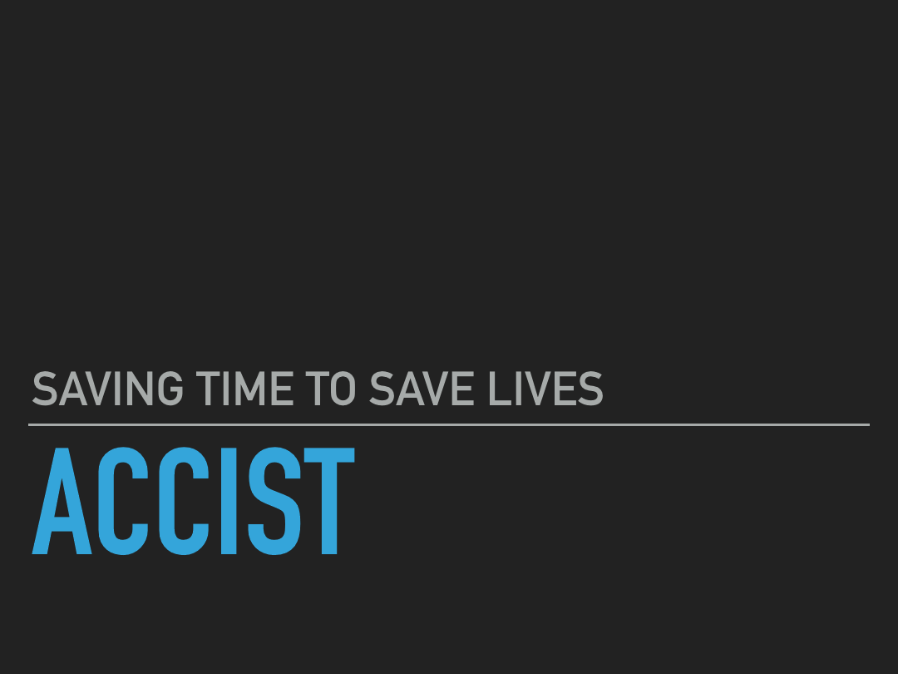
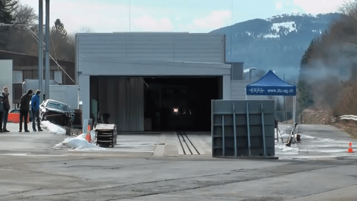

# ACCIST



This project aims to automatically detect car accidents from a live Camera feed.<br> 
As per the report **95%** of the deaths in car accidents occur due to the lag in early reporting & providing medical help. We are utilising the power of Artificial intelligence & Computer vision to automatically detect Road Accidents and provide the necessary medical emergency at the earliest.
***A STEP TOWARDS ROAD SAFETY AND SMART CITY***  <br>

## Have a Look

* **01. Video**

For the testing purpose I'm using a video of a car accident that you can see below.



* **02. Video Object Detection**

As a second step I've done video object detection for custom objects(Cars) whose results can be seen below.


* **03. Accident Detection**

For the final step I've used the above Object detected video. I extracted the detected car and passed that to my trained Accident detection model, if it detects accident then an alert of **ACCIDENT !** is displayed on the screen. This whole process has been done on each and every frame of the video by traversing it with the help of [OpenCV](https://opencv.org) library.


## Getting Started
These instructions will get you a copy of the project up and running on your local machine for development and testing purposes.

### Prerequisites
First you need to download every file in this [folder](https://drive.google.com/open?id=1Fd4FDT6TpPLIZuWU4ZGB0YI5cyWLxeSt) and place it in the **Assets** folder.
I'm assuming you have Python & basic libraries like Numpy, Pandas etc. already installed.<br>

* PyTorch
```
pip3 install torch torchvision
```
Visit [PyTorch](https://pytorch.org/) to install torch according to your system requirements

* TensorFlow
```
pip3 install --upgrade tensorflow
```

* OpenCV
```
pip3 install opencv-python
```

* Keras
```
pip3 install keras
```
* ImageAI
```
pip3 install https://github.com/OlafenwaMoses/ImageAI/releases/download/2.0.3/imageai-2.0.3-py3-none-any.whl
```

### Notebooks:-
* 01 [Video Object Detection]() This notebook guides you to the process of detecting objects in a Video<br>

* 02 [Model Training]() This notebook is focused on Model training. I've used a Pre-Trained model(DenseNet) for the training But the dataset was really rugged so I was able to achieve an accuracy of just 75%. But still it is good for a Prototype Model.<br>

* 03 [Securing Model & Accident detection on Video]() This notebook let you detect accidents from the object detected video. I tried implementing Encrypted Deep Learning but trust me the whole proces got much much slower than it was without it. So I sticked to the normal approach.<br>


## Built With
* [PyTorch](https://pytorch.org/) - For Model Training
* [ImageAI](http://imageai.org/) - For Video Object Detection part
* [OpenCV](https://opencv.org) - For playing with video frames

## Authors
* [Tanish Bhola](https://github.com/TanishB)
