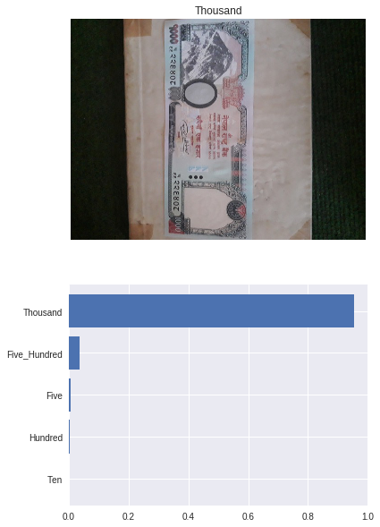
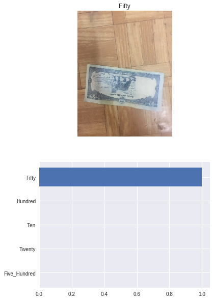
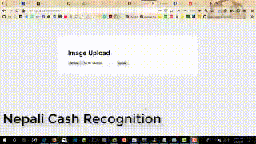

# Federated Learning on Nepali Cash Recognition for Visually Impaired using Pytorch and Pysyft

## Project Objective

In this project we will train an Currency Recognition model to recognize different denomination of currency also we will utilize the concept of Federated Learning using Pysyft.

### Project Steps
- Import useful packages.
- Download image datasets to google colab.
- Load and preprocess the image dataset.
- Hook PyTorch ie add extra functionalities to support Federated Learning
- Build an image classifier.
- Train the image classifier.
- Save and load the image classifier model in a checkpoint.
- Use the trained classifier to predict the image content.

#### Import useful packages

First thing first, let us import some useful packages which we are going to use later in the project. It is a very good practice to import all the packages at the very beginning of the code. As you work through this project and you need to use some new packages, don't forget to import them here first.

#### Test

Also I have deployed this project on Flask.
Sample Video

### Contributors

| Name | Slack |
| ------ | ------ |
| NischalLal Shrestha | @theonlynischal |

