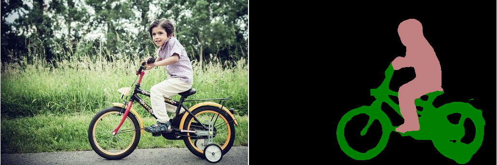

# Auto-Cropping: Demonstrating how can we use Segmentation to automate cropping 

Background removal is a task that is quite easy to do manually, or semi manually (Photoshop, and even Power Point has such tools) if you use some kind of a “marker” and edge detection. However, fully automated background removal is quite a challenging task.So i was quite inspired by this [idea](https://towardsdatascience.com/background-removal-with-deep-learning-c4f2104b3157).So I thought to work with this in a **Secure and private AI** project showcase challenge.

I used several techniques to perform segmentation but with [Mask-RCNN](https://github.com/matterport/Mask_RCNN) pretrained model I was not able to get a proper segementation.

     

Finally i studied about [DeepLab](https://github.com/tensorflow/models/tree/master/research/deeplab) is a state-of-art deep learning model for semantic image segmentaion it help me achieving my desired results for Demo.I used pretrined model for this project 'xception_coco_voctrainaug' on COCO dataset.  

     
     
     

# How To run 

**Script**: Crop.py

**arguments** : image_path ,background_path

**Example**:python Crop.py --image_path="/home/usman/Desktop/1936314_1690334921205554_3960288358644789045_n.jpg"  --    background_path="/home/usman/Desktop/pexels-photo-949587.jpeg"

**Explanation** :

**--image_path** : path to the image which need to be cropped 

**--background_path** :path to the background that you need to paste your cropped image on

**Visual Example**:

Path to input image and the background image 
 

     

In the following directories you can see your cropped image and the pasted image(on a background)

_cropped_image_ directory 

_pasted_image_  directory 

     

# Helping material 

Material that helped me and will help me in the future 

https://arxiv.org/abs/1606.00915

https://arxiv.org/abs/1505.04597

https://arxiv.org/abs/1703.03872

https://arxiv.org/abs/1703.06870

https://www.fast.ai/

https://medium.com/nanonets/how-to-do-image-segmentation-using-deep-learning-c673cc5862ef

https://medium.com/fnplus/blue-or-green-screen-effect-with-open-cv-chroma-keying-94d4a6ab2743

https://towardsdatascience.com/background-removal-with-deep-learning-c4f2104b3157
     

