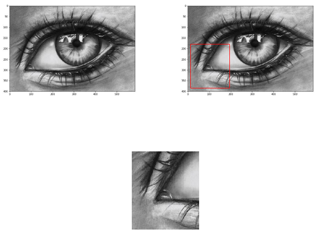

# Project Objective: 
## This project aims to acheive neural style transfer using the algorithm given by Paper [Image Style Transfer Using Convolutional Neural Networks by Gatys](https://arxiv.org/pdf/1508.06576.pdf), implemented in [Pytorch](https://pytorch.org/).   

    

# Theory and basic overview :
### Basics of CNN : 
Convolutional neural networks (CNN) are class of deep neural networks but differs from basic MLP (multi layer perceptron) in a way that unlike MLP , where all the neurons of the previous layers are connected to all the layers of next layers and this unnecessarily increases number of parameters whereas in CNN , at each layer only some of the neurons are connected to next layers , the neurons which are important to preserve the spatial information.
As we can see in the below picture how CNN's help in preserving spatial informative , as how these neurons are interconnected in 2D and thus helps in identifying patterns , relations among different parts of a image.

Hence, helping in extracting features , and also called feature extractors.

This works on the idea of mathematical operation called **convolution** , in simple words it is simply superimposing one function over the other and here also , we are masking the image with matrices known as **"kernels"** or **"filters"** and the results produced are called **"feature maps"**.

This graphics illustrates under the hood calculation of different feature maps which then combines over all the channels (1 for gray scale images and 3 for RGB images) produces the final result.
We can detect edges, contours based on the results of feature maps produced as sudden change in light intensity pixels confirms there is a edge so there values in features maps will signifactly differ around that region.

### Content and Style images
So, now we know how to extract features from a image using CNN.
Now, we are going to see what are content images and style images which we will be using in our algorithm to generate some new awesome artistic images.

**Content images** : images from which we are going to extract contours, borders, edges.

**Style images** : images from which we are going to extract textures, styles, artistic effects.

### The algorithmic process explained in simpler way

Suppose you start off with a empty canvas and starts painting it with your brush , and then you realized you are far away with what you imagined you would draw.
Then a idea striked you and you feel amazed to understand that in order to go towards the right direction you need to draw like following those lines which you are imagining so that difference between what you imagined and what you are drawing is miniming and thereby taking towards your final image.

Now think about this in terms of our content image and style image.
The algorithm requires that we start with our target image (which is our final image) , now there are two options for doing this :
* either we can start off by taking a empty convas
* or we can start from cloning (or copying content image)

Now let's understand this in geometrical way.  

> (image has been oversimplified for simplicity but mathematical explanations also lies ahead)

In the images , you can imagine a grid of pixels overlayed on them and try to understand.

  

**euclidean distance** :  

We can clearly see from the image , euclidean distance between copied content image and target image is less as compared to previous one.

Okay so we start with copied content image.  
But then how do we proceed further.  
So, basically CNN's have convolutional layers with classifier layers but since we need not classify anything here , so we will just use CNN as a feature extractor to extract edges, contours from content image and mix them up with textures extracted from style image to create a whole new artistic target image.
But how do we go about doing it.  
So, here now we wanna understood formally the _loss functions_ separately as content loss and style loss considering _distance between content image and target image and distance between style image and target image._

**content loss :**    

Let Fˡᵢⱼ(x)∈ Cₙₙ(x)and Pˡᵢⱼ(x) ∈ Cₙₙ(x) describe the respective intermediate feature representation of the network with inputs x and p at layer l   

   

**style loss :**    

correlation between different filter responses given by the **Gram matrix Gˡ**, where Gˡᵢⱼ is the inner product between the vectorized feature map i and j in layer l. We can see that Gˡᵢⱼ generated over the feature map for a given image represents the correlation between feature maps i and j.  
Thus, the total style loss across each layer is
    

where we weight the contribution of each layer’s loss by some factor wl  
   

where Gˡᵢⱼ and Aˡᵢⱼ are the respective style representation in layer l of input image x and style image 
    

You just need to know how dot product works.  
Dot product is simply multiplication of vectors component wise (corresponding elements multiplies).

    

Hence, total loss will be as follows :

    

where α and β are the weighting factors for content and style reconstruction, respectively.   

Now our objective is to minimize the total loss.

**Minimize total loss :**

We can apply our [gradient descent algorithm](https://medium.com/secure-and-private-ai-writing-challenge/playing-with-gradient-descent-intuition-e5bde385078) to minimize loss and [backpropogation algorithm](https://medium.com/secure-and-private-ai-writing-challenge/playing-with-backpropagation-algorithm-intuition-10c42578a8e8) to update parameters.  

  

# Model architechture VGG19 and hyperparameters summary :  

  

## Hyperparameters setting :  

* total iteration steps : 20000
* optimizer : [Adam](https://pytorch.org/docs/stable/_modules/torch/optim/adam.html)
* Learning rate : 0.003
* content_weight = 1 (alpha)
* style_weight = 1e6 (beta)
    

# The Results : 

* 
> Combined results of different images
* 
